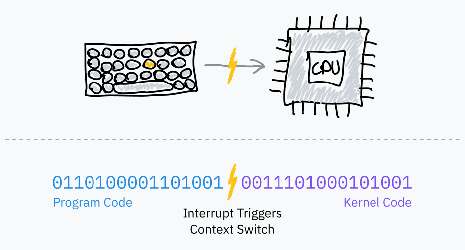

> [!IMPORTANT]
> この記事は[Putting the You in CPU](https://cpu.land/)の日本語訳です。原文は英語ですが、翻訳の過程で内容を少し変更したり、補足を加えたりしています。  
> MITライセンスで公開されている原文の内容は、[GitHub](https://github.com/hackclub/putting-the-you-in-cpu)で確認できます。  
> 著者、Kogniseとその他のHack Clubのメンバーに感謝します。  

---

    <a href="1-the-basics.md" class="button x-center">
    <- 1-the-basics
    </a>
    <a href="3-how-to-run-a-program.md" class="button x-center">
    3-how-to-run-a-program ->
    </a>

---

あなたがOSを作っていて、ユーザーに複数のプログラムを同時に動かしてほしいとしましょう。ただし、手元にあるのは立派なマルチコアCPUではありません。あなたのCPUは、一度に1命令しか実行できません。

でも、あなたは優秀なOS開発者です。そこで、プロセスにCPUを交代で使わせれば、並列っぽく見せられると気づきます。各プロセスを順番に回しながら、ひとつにつき数命令ずつ実行させれば、どれか1つのプロセスがCPUを独占することなく、全部が反応しているように見せられます。

では、どうやってプログラムのコードから制御を取り戻し、プロセスを切り替えるのでしょうか。少し調べると、多くのコンピュータにはタイマーチップが載っているとわかります。一定時間が経過したらOSの割り込みハンドラへ制御を移すように、そのタイマーチップを設定できるのです。

## ハードウェア割り込み

前の章では、ソフトウェア割り込みを使ってユーザーランドのプログラムからOSへ制御を渡す話をしました。これが「ソフトウェア」割り込みと呼ばれるのは、プログラム側が自発的に起こすからです。通常のフェッチ・実行サイクルの中で実行された機械語が、カーネルへ制御を切り替えろとプロセッサに伝えるわけです。

OSのスケジューラは、[PIT](https://en.wikipedia.org/wiki/Programmable_interval_timer) のような *タイマーチップ* を使って、マルチタスクのためのハードウェア割り込みを起こします。

1. プログラムのコードへ飛ぶ前に、OSは一定時間後に割り込みを起こすようタイマーチップを設定します。
2. OSはユーザーモードへ切り替え、プログラムの次の命令へ飛びます。
3. タイマーが満了すると、ハードウェア割り込みが発生し、カーネルモードへ切り替わってOSコードへ飛びます。
4. これでOSは、そのプログラムがどこまで実行したかを保存し、別のプログラムを読み込み、同じ手順を繰り返せます。

これを *プリエンプティブ・マルチタスキング* と呼び、プロセスを途中で止めることを[*プリエンプション*](https://en.wikipedia.org/wiki/Preemption_(computing))と呼びます。たとえばこの文章をブラウザで読みながら同じマシンで音楽を聴いているなら、あなたのコンピュータはおそらく、まさにこの循環を1秒間に何千回も繰り返しています。

## タイムスライスの計算

*タイムスライス* とは、OSスケジューラがプロセスを止めるまでに走らせる時間の長さです。もっとも単純なのは、すべてのプロセスへ同じ長さ、たとえば10&nbsp;ms前後のタイムスライスを与え、順番に回していく方法です。これは *固定タイムスライスのラウンドロビン* スケジューリングと呼ばれます。

> **余談: 用語小ネタ**
> 
> タイムスライスはしばしば quantum とも呼ばれます。これであなたも技術系の友人相手に小ネタを披露できます。この記事で2文に1回 quantum と言わずに済ませた私には、かなりの称賛があっていいと思います。
> 
> タイムスライス用語つながりでもうひとつ。Linuxカーネル開発者は、固定周波数タイマーの刻みを数える単位として [jiffy](https://github.com/torvalds/linux/blob/22b8cc3e78f5448b4c5df00303817a9137cd663f/include/linux/jiffies.h) を使います。jiffyはタイムスライスの長さを測る用途にも使われます。Linuxのjiffy周波数は通常1000 Hzですが、カーネルのビルド時に設定できます。

固定タイムスライス方式を少し改善したものとして、*目標レイテンシ* を決める方法があります。これは、プロセスが応答を返すまでに理想的にはこれ以上かかってほしくない、という最大時間です。ここでいう目標レイテンシとは、ある程度妥当な数のプロセスがある前提で、プリエンプトされたプロセスが再び実行を再開するまでの時間を指します。*少しイメージしづらいですよね。大丈夫です。すぐ図が出てきます。*

タイムスライスは、目標レイテンシをタスク総数で割って計算します。これは固定タイムスライスより優れていて、プロセス数が少ない場合の無駄な切り替えを減らせます。目標レイテンシが15&nbsp;msでプロセスが10個なら、各プロセスに与えられる時間は 15/10 で 1.5&nbsp;ms です。プロセスが3個しかなければ、それでも目標レイテンシを守りつつ、各プロセスはもっと長い 5&nbsp;ms のタイムスライスを得られます。

プロセス切り替えには計算コストがかかります。現在のプログラムの状態を丸ごと保存し、別のプログラムの状態を復元しなければならないからです。ある点を超えてタイムスライスが小さくなりすぎると、切り替えが頻発しすぎて性能問題になります。そのため、タイムスライスの長さには下限、つまり *最小粒度* を設けるのが一般的です。もちろんその場合、プロセス数が十分多くて最小粒度が効き始めると、目標レイテンシは超過します。

この記事執筆時点で、Linuxのスケジューラは目標レイテンシとして 6&nbsp;ms、最小粒度として 0.75&nbsp;ms を使っています。

この基本的なタイムスライス計算を使うラウンドロビン方式は、いまの多くのコンピュータが実際にやっていることにかなり近いです。ただし、まだ少し素朴です。大半のOSは、プロセスの優先度や締切も考慮した、もっと複雑なスケジューラを持っています。Linuxは2007年以降、[Completely Fair Scheduler](https://docs.kernel.org/scheduler/sched-design-CFS.html) と呼ばれるスケジューラを使っています。CFSは、タスクへ優先順位をつけてCPU時間を配るために、かなり凝った計算機科学的なことをいろいろやっています。

OSがプロセスをプリエンプトするたびに、新しいプログラムの保存済み実行コンテキストを読み込む必要があります。その中には、そのプログラムのメモリ環境も含まれます。これは、CPUに別の *ページテーブル*、つまり「仮想」アドレスから物理アドレスへの対応表を使わせることで実現されます。これは同時に、プログラムどうしが互いのメモリへ触れられないようにする仕組みでもあります。この話は[第5章](/the-translator-in-your-computer)と[第6章](/lets-talk-about-forks-and-cows)で掘り下げます。

## 補足その1: カーネルのプリエンプト性

ここまで話してきたのは、ユーザーランドのプロセスに対するプリエンプトとスケジューリングだけでした。もしカーネルコードが、システムコール処理やドライバ実行に長くかかりすぎると、プログラム全体が重く感じられてしまいます。

Linuxを含む現代のカーネルは、[プリエンプティブ・カーネル](https://en.wikipedia.org/wiki/Kernel_preemption)です。つまり、カーネルコード自身も、ユーザーランドのプロセスと同じように中断され、スケジュールされるよう設計されています。

これは自分でカーネルを書くのでなければ、そこまで重要な知識ではないかもしれません。ただ、私が読んだ記事はだいたい全部ここに触れていたので、私も触れておこうと思いました。知識は多いに越したことはあまりありません。

## 補足その2: ちょっとした歴史の話

古いOS、たとえばクラシックMac OSや、NT以前のかなり昔のWindowsは、プリエンプティブ・マルチタスキングの前段階にあたる方式を使っていました。OSがいつプログラムを止めるかを決めるのではなく、プログラム自身が「そろそろOSに制御を返します」と判断して譲っていたのです。プログラムはソフトウェア割り込みを起こして、「はい、次のプログラムを走らせていいですよ」と知らせます。こうした明示的な譲渡だけが、OSが制御を取り戻して次のプロセスへ切り替える手段でした。

これは[*協調的マルチタスキング*](https://en.wikipedia.org/wiki/Cooperative_multitasking)と呼ばれます。この方式には大きな欠点がいくつかあります。悪意のあるプログラムや単に出来の悪いプログラムが、OS全体を簡単に固められてしまうこと。さらに、リアルタイム処理や時間に敏感なタスクで時間的一貫性を保証するのがほぼ不可能なことです。そのため技術の世界は、かなり前にプリエンプティブ・マルチタスキングへ移行し、それ以来ほとんど戻っていません。

---

    <a href="1-the-basics.md" class="button x-center">
    <- 1-the-basics
    </a>
    <a href="3-how-to-run-a-program.md" class="button x-center">
    3-how-to-run-a-program ->
    </a>

---
