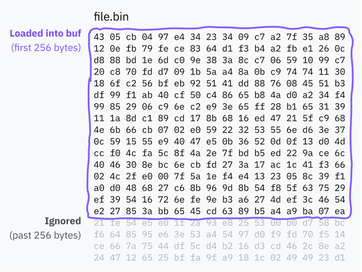

> [!IMPORTANT]
> この記事は[Putting the You in CPU](https://cpu.land/)の日本語訳です。原文は英語ですが、翻訳の過程で内容を少し変更したり、補足を加えたりしています。  
> MITライセンスで公開されている原文の内容は、[GitHub](https://github.com/hackclub/putting-the-you-in-cpu)で確認できます。  
> 著者、Kogniseとその他のHack Clubのメンバーに感謝します。  

---
<div class="grid2">
	<a href="2-slice-dat-time.md" class="button x-center">
	<- 2-slice-dat-time
	</a>
	<a href="4-becoming-an-elf-lord.md" class="button x-center">
	4-becoming-an-elf-lord ->
	</a>
</div>

---

ここまでで、CPUが実行ファイルから読み込まれた機械語をどう実行するか、リングによる保護が何か、そしてシステムコールがどう動くかを見てきました。この章では、Linuxカーネルの中へ深く入り込み、そもそもプログラムがどのように読み込まれ、実行されるのかを追っていきます。

対象をLinux on x86-64に絞るのには理由があります。

- Linuxは、デスクトップ、モバイル、サーバのいずれにも使われる本格的なOSです。しかもオープンソースなので、ソースコードを読めばかなり直接的に調べられます。この記事でも実際にカーネルコードを参照します。
- x86-64は、現代のデスクトップコンピュータの大半で使われているアーキテクチャであり、多くのコードが対象にしているアーキテクチャでもあります。ここで触れるx86-64固有の振る舞いも、かなり広く一般化できます。

細部は違っても、ここで学ぶ内容の多くは他のOSやアーキテクチャにもかなりそのまま通用します。

## exec系システムコールの基本動作


まずは非常に重要なシステムコール、`execve` から始めましょう。これはプログラムを読み込み、成功すれば現在のプロセスをそのプログラムで置き換えます。`execlp` や `execvpe` など他のexec系システムコールもありますが、どれもさまざまな形で `execve` の上に乗っています。

> **余談: `execveat`**
> 
> 実は `execve` は、もう少し汎用的な `execveat` の上に作られています。`execveat` は設定オプション付きでプログラムを実行するシステムコールです。話を簡単にするため、この章では主に `execve` と書きます。違いは、`execve` が `execveat` にいくつかの既定値を与えている点だけです。
>
> `ve` が何の略か気になりますか。`v` は引数ベクタ、つまり引数の配列 (`argv`) を表し、`e` は環境変数ベクタ (`envp`) を表します。ほかのexec系システムコールも、呼び出しシグネチャの違いを表すために別の接尾辞を持っています。`execveat` の `at` は、そのまま「どこで `execve` を実行するか」を指定する `at` です。

`execve` のシグネチャは次のとおりです。

```c
int execve(const char *filename, char *const argv[], char *const envp[]);
```

- `filename` 引数は、実行するプログラムのパスを指定します。
- `argv` は、プログラムへ渡す引数のヌル終端リストです。つまり最後の要素がヌルポインタです。Cの `main` 関数でよく見る `argc` は、実は後でシステムコール側がこの配列から数えて計算します。だからヌル終端になっています。
- `envp` には、アプリケーションの文脈として使う環境変数の、これまたヌル終端リストが入ります。形式は……慣習的には `KEY=VALUE` です。*あくまで慣習的には。* コンピュータってこういうところがあります。

ひとつ面白い話があります。プログラムの第1引数はプログラム名、というお約束を知っていますか。あれは *完全に慣習* であって、`execve` 自体がそう設定しているわけではありません。第1引数には、`argv` の最初の要素として `execve` に渡されたものが、そのまま入ります。プログラム名と何の関係もなくても構いません。

面白いことに、`execve` 周辺のコードには `argv[0]` がプログラム名であることを前提にしている箇所もあります。これについては、インタプリタ型スクリプト言語の話をするときにまた出てきます。

### ステップ0: 定義を見る

システムコールの仕組み自体はもう知っていますが、実際のコードをまだ見ていません。Linuxカーネルのソースを見て、`execve` が内部でどう定義されているのか確認してみましょう。

```c
SYSCALL_DEFINE3(execve,
		const char __user *, filename,
		const char __user *const __user *, argv,
		const char __user *const __user *, envp)
{
	return do_execve(getname(filename), argv, envp);
}
```

`SYSCALL_DEFINE3` は、引数3個のシステムコールを定義するためのマクロです。

> どうしてマクロ名に[引数個数](https://en.wikipedia.org/wiki/Arity)が埋め込まれているのか気になって調べてみたところ、これは[ある種のセキュリティ脆弱性](https://nvd.nist.gov/vuln/detail/CVE-2009-0029)への対処として入った仕組みだとわかりました。

`filename` 引数は `getname()` 関数へ渡されます。これはユーザー空間の文字列をカーネル空間へコピーし、いくつかの利用追跡も行います。戻り値は `filename` 構造体で、これは `include/linux/fs.h` で定義されています。そこには、元のユーザー空間文字列へのポインタと、カーネル空間へコピーされた値への新しいポインタの両方が入っています。

```c
struct filename {
	const char		*name;	/* pointer to actual string */
	const __user char	*uptr;	/* original userland pointer */
	int			refcnt;
	struct audit_names	*aname;
	const char		iname[];
};
```

`execve` システムコールはその後 `do_execve()` を呼びます。そして `do_execve()` は、いくつか既定値を与えて `do_execveat_common()` を呼びます。先ほど触れた `execveat` も同じ `do_execveat_common()` を呼びますが、こちらはユーザー指定のオプションをもっと多くそのまま渡します。

以下の抜粋では、`do_execve` と `do_execveat` の両方を載せています。

```c
static int do_execve(struct filename *filename,
	const char __user *const __user *__argv,
	const char __user *const __user *__envp)
{
	struct user_arg_ptr argv = { .ptr.native = __argv };
	struct user_arg_ptr envp = { .ptr.native = __envp };
	return do_execveat_common(AT_FDCWD, filename, argv, envp, 0);
}

static int do_execveat(int fd, struct filename *filename,
		const char __user *const __user *__argv,
		const char __user *const __user *__envp,
		int flags)
{
	struct user_arg_ptr argv = { .ptr.native = __argv };
	struct user_arg_ptr envp = { .ptr.native = __envp };

	return do_execveat_common(fd, filename, argv, envp, flags);
}
```

\[spacing sic\]

`execveat` では、ファイルディスクリプタ（*何らかの資源* を指すIDの一種）がシステムコール経由で `do_execveat_common` へ渡されます。これは、そのプログラムをどのディレクトリ基準で実行するかを指定します。

`execve` のほうでは、ファイルディスクリプタ引数に特別な値 `AT_FDCWD` が使われます。これはLinuxカーネル内で共有されている定数で、パス名をカレントディレクトリ基準で解釈せよ、という意味です。ファイルディスクリプタを受け取る関数には、たいてい <code>if&nbsp;(fd&nbsp;==&nbsp;AT_FDCWD) \{&nbsp;/\*&nbsp;special codepath&nbsp;\*/&nbsp;\}</code> のような分岐が入っています。

### ステップ1: 準備

ここで、プログラム実行の中核を担う `do_execveat_common` にたどり着きました。少しコードから目を離して、この関数が全体として何をしているのかを見てみましょう。

`do_execveat_common` の最初の大仕事は、`linux_binprm` という構造体を組み立てることです。[構造体定義全体](https://github.com/torvalds/linux/blob/22b8cc3e78f5448b4c5df00303817a9137cd663f/include/linux/binfmts.h#L15-L65)は長いのでここには載せませんが、重要なフィールドはいくつかあります。

- `mm_struct` や `vm_area_struct` のようなデータ構造が用意され、新しいプログラム用の仮想メモリ管理を準備します。
- `argc` と `envc` が計算され、プログラムへ渡すために保存されます。
- `filename` と `interp` には、それぞれプログラム本体のファイル名と、そのインタプリタのファイル名が入ります。最初は同じ値ですが、場合によって変わります。代表例が [shebang](https://en.wikipedia.org/wiki/Shebang_(Unix)) 付きのスクリプトです。たとえばPythonプログラムを実行する場合、`filename` はソースファイルを指し、`interp` はPythonインタプリタのパスを指します。
- `buf` は、実行対象ファイルの先頭256バイトを格納する配列です。ファイル形式の判定や、スクリプトのshebang読み取りに使われます。

（ちなみに binprm は **bin**ary **pr**og**r**a**m** の略です。）

この `buf` をもう少し詳しく見てみましょう。

```c
	char buf[BINPRM_BUF_SIZE];
```

As we can see, its length is defined as the constant `BINPRM_BUF_SIZE`. By searching the codebase for this string, we can find a definition for this in `include/uapi/linux/binfmts.h`:

```c
/* sizeof(linux_binprm->buf) */
#define BINPRM_BUF_SIZE 256
```

つまり、カーネルは実行対象ファイルの先頭256バイトをこのメモリバッファへ読み込みます。

> **余談: UAPIって何？**
> 
> 上のコードのパスに `/uapi/` が含まれていることに気づいたかもしれません。なぜ長さの定義が、`linux_binprm` 構造体のある `include/linux/binfmts.h` と同じファイルにないのでしょうか。
>
> UAPI は "userspace API" の略です。この場合は、誰かが「このバッファ長はカーネルの公開APIの一部にすべきだ」と決めた、という意味です。理屈の上では、UAPIに属するものはすべてユーザーランドへ公開され、UAPIでないものはカーネル内部専用です。
>
> カーネル空間のコードとユーザー空間向けコードは、もともとかなり雑然と同居していました。2012年に、保守性向上のためUAPIコードが[別ディレクトリへ整理](https://lwn.net/Articles/507794/)されました。

### ステップ2: binfmt

カーネルの次の大仕事は、"binfmt"（binary format）ハンドラをひとつずつ試していくことです。これらのハンドラは `fs/binfmt_elf.c` や `fs/binfmt_flat.c` のようなファイルで定義されています。[カーネルモジュール](https://wiki.archlinux.org/title/Kernel_module)が独自のbinfmtハンドラを追加することもできます。

各ハンドラは `load_binary()` 関数を公開していて、`linux_binprm` 構造体を受け取り、そのプログラム形式を自分が理解できるかどうかを調べます。

ここではしばしば、バッファ内の[マジックナンバー](https://en.wikipedia.org/wiki/Magic_number_(programming))を見たり、同じくバッファからプログラム先頭をデコードしてみたり、拡張子を確認したりします。その形式に対応していれば、ハンドラはプログラム実行の準備をして成功コードを返します。そうでなければ早々に諦めてエラーコードを返します。

カーネルは成功するものに当たるまで、各binfmtの `load_binary()` を順に試します。これが再帰的に呼ばれることもあります。たとえばスクリプトにインタプリタが指定されていて、そのインタプリタ自身もまたスクリプトだった場合、`binfmt_script` → `binfmt_script` → `binfmt_elf` という連鎖になるかもしれません。最後にあるELFが、実際に実行されるバイナリ形式です。

### 形式別ハイライト: スクリプト

Linuxが対応している多くの形式の中で、最初に取り上げたいのは `binfmt_script` です。

[shebang](https://en.wikipedia.org/wiki/Shebang_(Unix)) を見たことはありますか。スクリプトの先頭にあって、インタプリタのパスを書くあの行です。

```bash
#!/bin/bash
```

私は長いこと、これはシェルが処理しているのだと思っていました。でも違います。shebangは実はカーネルの機能で、スクリプトもほかのプログラムと同じシステムコールで実行されます。コンピュータ、やっぱり面白い。

`fs/binfmt_script.c` が、ファイルの先頭がshebangかどうかをどう判定しているか見てみましょう。

```c
	/* Not ours to exec if we don't start with "#!". */
	if ((bprm->buf[0] != '#') || (bprm->buf[1] != '!'))
		return -ENOEXEC;
```

ファイルが実際にshebangで始まっていれば、このbinfmtハンドラはインタプリタのパスと、その後ろに空白区切りで続く引数を読み取ります。改行に当たるか、バッファ末尾へ達したところで止まります。

ここには、面白いけれど少し変な点が2つあります。

**第一に**、`linux_binprm` の先頭256バイト入りバッファを覚えていますか。あれは実行形式の判定にも使われますが、`binfmt_script` ではshebangの読み取りにも同じバッファが使われます。

調べている途中で、このバッファは128バイトだと書いてある記事を読みました。ところが、その記事の公開後どこかの時点で、長さは256バイトへ倍増していました。なぜか気になって、Linuxソースの `BINPRM_BUF_SIZE` 定義行に対して Git blame、つまりその行を誰が編集したかの履歴を見てみると……。

![Visual Studio Code上の Git blame 画面のスクリーンショット。#define BINPRM_BUF_SIZE 128 という行が256へ変更されたことが示されている。コミットは Oleg Nesterov によるもので、本文には exec: increase BINPRM_BUF_SIZE to 256. Large enterprise clients often run applications out of networked file systems where the IT mandated layout of project volumes can end up leading to paths that are longer than 128 characters. Bumping this up to the next order of two solves this problem in all but the most egregious case while still fitting into a 512b slab. と書かれている。Linus Torvalds らの sign-off も付いている。](images/binprm-buf-changelog.png)

コンピュータ、本当に面白い。


shebangはカーネルが処理し、しかもファイル全体ではなく `buf` から読むので、*必ず* `buf` の長さで切り詰められます。どうやら4年ほど前、カーネルが128文字超のパスを途中で切ってしまうことに誰かが困り、その解決策としてバッファ長を倍にして切り詰め位置も倍にしたようです。つまり今日でも、あなたのLinuxマシンでshebang行が256文字を超えていたら、その先は *完全に失われます*。



これが原因でバグを踏んだ場面を想像してみてください。コードが壊れている根本原因を探して、ついに問題がLinuxカーネルの深部にあるとわかったときの気持ちを。巨大企業で、パスの一部がなぜか消えていることに気づく次のIT担当者には心から同情します。

**第二の変な点** は、`argv[0]` がプログラム名だというのは *単なる慣習* にすぎず、呼び出し元は好きな `argv` をexec系システムコールへ渡せるし、それが特に検査されず通ってしまう、という話を思い出してください。

`binfmt_script` はまさに、`argv[0]` がプログラム名だと *仮定している* 箇所のひとつです。このハンドラは必ず `argv[0]` を取り除き、そのうえで `argv` の先頭に次のものを追加します。

- インタプリタへのパス
- インタプリタへの引数
- スクリプトのファイル名

<blockquote>
**例: 引数の書き換え**

具体例として、次の `execve` 呼び出しを見てみましょう。

```c
// 引数: filename, argv, envp
execve("./script", [ "A", "B", "C" ], []);
```

この仮想的な `script` ファイルの先頭行には、次のshebangが書かれているとします。

```js
#!/usr/bin/node --experimental-module
```

こうして最終的にNodeインタプリタへ渡される `argv` は、次のようになります。

```c
[ "/usr/bin/node", "--experimental-module", "./script", "B", "C" ]
```
</blockquote>

`argv` を更新したあと、ハンドラは `linux_binprm.interp` にインタプリタのパス（この場合はNodeバイナリ）を設定し、ファイルの実行準備を終えます。最後に、準備に成功したことを示す 0 を返します。

### 形式別ハイライト: その他のインタプリタ

もうひとつ面白いハンドラが `binfmt_misc` です。これは `/proc/sys/fs/binfmt_misc/` に特別なファイルシステムをマウントすることで、ユーザーランドの設定から限定的に新しい形式を追加できるようにします。プログラムはこのディレクトリ内のファイルへ[特定形式の書き込み](https://docs.kernel.org/admin-guide/binfmt-misc.html)を行うことで、自前のハンドラを追加できます。各設定エントリは次のことを指定します。

- そのファイル形式をどう検出するか。特定オフセットにあるマジックナンバーでも、拡張子でも指定できます。
- インタプリタ実行ファイルのパス。インタプリタ引数を直接指定する方法はないので、必要ならラッパースクリプトが必要です。
- `binfmt_misc` が `argv` をどう更新するかを含む、いくつかの設定フラグ。

この `binfmt_misc` はJava環境でよく使われていて、classファイルを `0xCAFEBABE` のマジックバイトで検出したり、JARファイルを拡張子で検出したりするよう設定されます。私の環境では、`.pyc` 拡張子でPythonバイトコードを検出して適切なハンドラへ回す設定も入っていました。

高い特権が必要なカーネルコードを書かずに、インストーラ側が独自形式への対応を追加できる、かなり面白い仕組みです。

## 結局のところ（Linkin Parkの曲の話ではない）

exec系システムコールの結末は、必ず次のどちらかです。

- 途中に何段ものスクリプトインタプリタを挟むことはあっても、最終的には理解できる実行可能バイナリ形式へたどり着き、そのコードを実行する。この時点で、古いコードは置き換えられています。
- あるいは、試せる手をすべて試し尽くし、しょんぼりとエラーコードを呼び出し元へ返す。

Unix系システムを使ったことがあるなら、shebang行も `.sh` 拡張子もないシェルスクリプトが、端末からだと普通に実行できることに気づいたかもしれません。Windows以外の端末が使えるなら、今すぐ試せます。

```
$ echo "echo hello" > ./file
$ chmod +x ./file
$ ./file
hello
```

（`chmod +x` は、そのファイルを実行可能としてOSへ伝えるコマンドです。これをしないと実行できません。）

では、なぜそのファイルはシェルスクリプトとして実行されるのでしょう。目印が何もないのに、カーネルの形式ハンドラにはシェルスクリプトだと判定する明確な手段がないはずです。

実はこの挙動はカーネルの仕事ではありません。これは *シェル* 側が失敗時に行う、よくあるフォールバック処理です。

シェル経由でファイルを実行して、exec系システムコールが失敗した場合、多くのシェルは *そのファイルをシェルスクリプトとして再実行* します。やり方は、ファイル名を第1引数にしてシェル自身を起動する、というものです。Bashは普通、自分自身をインタプリタとして使い、ZSHは `sh` が指しているもの、通常は [Bourne shell](https://en.wikipedia.org/wiki/Bourne_shell) を使います。

この挙動が広く見られるのは、Unix系システム間でコードを移植しやすくするための古い標準、[*POSIX*](https://en.wikipedia.org/wiki/POSIX) に定められているからです。POSIXは今や多くのツールやOSで厳密には守られていませんが、それでも慣習の多くは今も共有されています。

> もし \[exec系システムコール\] が `[ENOEXEC]` に相当するエラーで失敗した場合、**シェルは、そのコマンド名を第1オペランドとしてシェルを起動したのと等価なコマンドを実行しなければならない**。残りの引数は新しいシェルへ渡される。実行ファイルがテキストファイルでない場合、シェルはこの実行を省略してもよい。その場合、シェルはエラーメッセージを書き出し、終了ステータス126を返さなければならない。
> 
> *出典: <cite>[Shell Command Language, POSIX.1-2017](https://pubs.opengroup.org/onlinepubs/9699919799.2018edition/utilities/V3_chap02.html#tag_18_09_01_01)</cite>*

コンピュータ、本当に面白い。

---
<div class="grid2">
	<a href="2-slice-dat-time.md" class="button x-center">
	<- 2-slice-dat-time
	</a>
	<a href="4-becoming-an-elf-lord.md" class="button x-center">
	4-becoming-an-elf-lord ->
	</a>
</div>

---