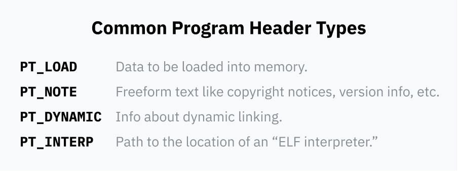
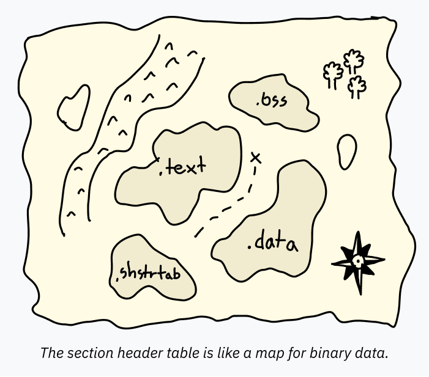
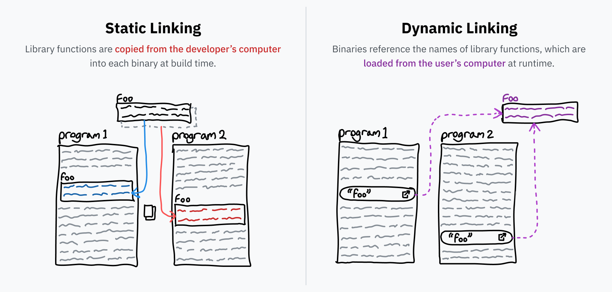

> [!IMPORTANT]
> この記事は[Putting the You in CPU](https://cpu.land/)の日本語訳です。原文は英語ですが、翻訳の過程で内容を少し変更したり、補足を加えたりしています。  
> MITライセンスで公開されている原文の内容は、[GitHub](https://github.com/hackclub/putting-the-you-in-cpu)で確認できます。  
> 著者、Kogniseとその他のHack Clubのメンバーに感謝します。  

---
<div class="grid2">
    <a href="3-how-to-run-a-program.md" class="button x-center">
    <- 3-how-to-run-a-program
    </a>
    <a href="5-the-translator-in-your-computer.md" class="button x-center">
    5-the-translator-in-your-computer ->
    </a>
</div>

---

これで `execve` はかなりしっかり理解できました。多くの場合、カーネルは最終的に、実際に起動すべき機械語を含んだプログラムへたどり着きます。ただし、そのコードへ本当にジャンプする前には、たいてい準備が必要です。たとえばプログラムの各部分をメモリ上の正しい場所へ読み込まなければなりません。プログラムごとに必要なメモリの量や用途は違うので、実行時のセットアップ方法を記述する標準ファイル形式が存在します。Linuxは複数の形式に対応していますが、圧倒的に一般的なのが *ELF*（executable and linkable format）です。


<div style='text-align: center;'>
	<p style='margin-top: -10px;'>
        （かわいい絵を描いてくれた <a href='https://ncase.me/' target='_blank'>Nicky Case</a> に感謝します。）
	</p>
</div>

> **余談: エルフはどこにでもいるのか？**
> 
> Linuxでアプリやコマンドラインプログラムを実行するとき、その正体はたいていELFバイナリです。一方、macOSでの事実上の標準形式は [Mach-O](https://en.wikipedia.org/wiki/Mach-O) です。Mach-OはELFと同じ役割を果たしますが、構造は異なります。Windowsの `.exe` ファイルは [Portable Executable](https://en.wikipedia.org/wiki/Portable_Executable) 形式を使っていて、これもまた同じ発想の別形式です。

Linuxカーネルでは、ELFバイナリは `binfmt_elf` ハンドラが処理します。これは他の多くのハンドラより複雑で、数千行のコードを持っています。ELFファイルから必要な情報を読み取り、それを使ってプロセスをメモリへ読み込み、実行に持ち込むのがその役目です。

*コマンドライン小技で、binfmtハンドラを行数順に並べてみました。*

```
$ wc -l binfmt_* | sort -nr | sed 1d
    2181 binfmt_elf.c
    1658 binfmt_elf_fdpic.c
     944 binfmt_flat.c
     836 binfmt_misc.c
     158 binfmt_script.c
      64 binfmt_elf_test.c
```

## ファイル構造

`binfmt_elf` がELFファイルをどう実行するかを詳しく見る前に、まずはELFファイル形式そのものを見ておきましょう。ELFファイルは通常、4つの部分から成り立っています。


### ELFヘッダ

すべてのELFファイルには [ELFヘッダ](https://refspecs.linuxfoundation.org/elf/gabi4+/ch4.eheader.html) があります。ここには、バイナリに関する基本情報が入っています。とても重要な部分です。たとえば次のような情報です。

- どのプロセッサ上で動かすつもりか。ELFファイルにはARMやx86など、さまざまなCPU向けの機械語を入れられます。
- そのバイナリが単体で実行される実行ファイルなのか、それとも他のプログラムから読み込まれる「動的リンクライブラリ」なのか。動的リンクについてはすぐ後で説明します。
- 実行開始地点、つまりエントリポイント。後の節では、ELFに含まれるデータをメモリ上のどこへ置くかが指定されます。エントリポイントは、その読み込みが終わったあと最初の機械語命令があるメモリアドレスを指します。

ELFヘッダは常にファイル先頭にあります。そこには、program header table と section header の位置が書かれています。これらの表はファイル内のどこにあってもよく、さらにその表が別のデータ領域を指しています。

### Program Header Table

[program header table](https://refspecs.linuxbase.org/elf/gabi4+/ch5.pheader.html) は、実行時にそのバイナリをどう読み込み、どう実行するかの具体的情報を持つエントリ列です。各エントリには type フィールドがあり、そのエントリが何を表すかを示します。たとえば `PT_LOAD` ならメモリへ読み込むべきデータを含むことを意味し、`PT_NOTE` なら必ずしもどこかへ読み込む必要のない補足情報を表します。



各エントリには、データがファイル中のどこにあり、場合によってはどうやってメモリへ読み込むかが書かれています。

- ELFファイル内でそのデータがどこにあるかを示します。
- そのデータを仮想メモリ上のどこへ読み込むべきかを指定できます。メモリへ読み込まないセグメントなら、通常ここは空です。
- データ長を表すフィールドが2つあります。ひとつはファイル中のデータ長、もうひとつは作るべきメモリ領域の長さです。メモリ領域のほうが長ければ、余った部分はゼロ埋めされます。これは、実行時に使う静的メモリ領域を持ちたいプログラムに便利です。こうした空のメモリ領域は通常 [BSS](https://en.wikipedia.org/wiki/.bss) セグメントと呼ばれます。
- 最後に flags フィールドがあり、メモリへ載せたあと何を許可するかを示します。`PF_R` は読み取り可、`PF_W` は書き込み可、`PF_X` はCPUによる実行可を意味します。

### Section Header Table

[section header table](https://refspecs.linuxbase.org/elf/gabi4+/ch4.sheader.html) は、*section* に関する情報を持つエントリ列です。section情報は、ELFファイルの中にどんなデータがどこにあるかを示す地図のようなものです。これによって、[デバッガのようなプログラム](https://www.sourceware.org/gdb/)が各データ領域の意図を理解しやすくなります。



たとえば、program header table は広いデータ範囲をまとめてメモリへ読み込むよう指定できます。ひとつの `PT_LOAD` ブロックの中に、コードもグローバル変数も両方入っているかもしれません。プログラムを *実行する* だけなら、それらを別々に示す必要はありません。CPUはエントリポイントから始めて前へ進み、必要なとき必要な場所のデータへアクセスするだけです。しかし、プログラムを *解析する* デバッガのようなソフトウェアには、各領域の開始位置と終了位置が正確にわかっている必要があります。でないと、hello という文字列をコードとしてデコードしようとして爆発しかねません。そうした情報が section header table に入っています。

通常は含まれていますが、section header table は実は必須ではありません。ELFファイルはそれを丸ごと取り除いても普通に実行できます。だから、自分のコードの中身を隠したい開発者は、[解析しにくくするため](https://binaryresearch.github.io/2019/09/17/Analyzing-ELF-Binaries-with-Malformed-Headers-Part-1-Emulating-Tiny-Programs.html)に、意図的に section header table を削ったり壊したりすることがあります。

各sectionには名前、型、そしてどう使われどう解釈されるべきかを示すフラグがあります。標準的な名前は慣習としてドットで始まることが多いです。代表的なsectionは次のとおりです。

- `.text`: メモリへ読み込まれ、CPUで実行される機械語です。型は `SHT_PROGBITS`、実行可能であることを示す `SHF_EXECINSTR` フラグと、実行用にメモリへ載せることを示す `SHF_ALLOC` フラグが付きます。（名前に惑わされないでください。これは読みやすい「テキスト」ではなく、ただのバイナリ機械語です。個人的には `.text` という名前は少し不思議に感じます。）
- `.data`: 実行ファイルに埋め込まれていて、メモリへ読み込まれる初期化済みデータです。たとえばテキストを含むグローバル変数はここに入るかもしれません。低レベルコードを書くなら、staticなデータが行く場所です。型はこれも `SHT_PROGBITS` で、単に「プログラム用の情報が入っている」という意味です。フラグは `SHF_ALLOC` と `SHF_WRITE` で、書き込み可能メモリであることを示します。
- `.bss`: 先ほど、最初はゼロ埋めされた状態で確保されるメモリ領域の話をしました。大量の空バイトをELFへそのまま入れるのは無駄なので、BSSという特別なセグメント型が使われます。デバッグ時にはBSS領域の存在がわかると便利なので、section header table にも、確保すべきメモリ長を示すエントリがあります。型は `SHT_NOBITS`、フラグは `SHF_ALLOC` と `SHF_WRITE` です。
- `.rodata`: `.data` に似ていますが、読み取り専用です。たとえば `printf("Hello, world!")` を呼ぶごく単純なCプログラムでは、文字列 "Hello, world!" は `.rodata` にあり、実際に出力するコードは `.text` にあります。
- `.shstrtab`: これは実装上のちょっと面白い細部です。section自身の名前（`.text` や `.shstrtab` など）は、section header table の中に直接入っていません。代わりに各エントリには、その名前が置かれているELFファイル内位置へのオフセットが入っています。こうすると、section header table の各エントリを同じサイズに揃えられ、解析しやすくなります。名前へのオフセットは固定長数値ですが、名前文字列そのものを入れると可変長になってしまうからです。こうした名前データはすべて `.shstrtab` という専用sectionに置かれ、型は `SHT_STRTAB` です。

### データ本体

program header table と section header table のエントリは、それぞれELFファイル内のデータブロックを指しています。メモリへ読み込むためだったり、プログラムコードの位置を示すためだったり、section名の文字列を指すためだったりします。こうしたさまざまなデータ片は、ELFファイルのデータ領域にまとめて格納されています。


## リンクの簡単な説明

`binfmt_elf` のコードへ戻りましょう。カーネルが特に気にする program header table エントリは2種類あります。

`PT_LOAD` セグメントは、`.text` や `.data` のようなプログラムデータをメモリ上のどこへ読み込むかを指定します。カーネルはELFファイルからこれらのエントリを読み、CPUがそのプログラムを実行できるようデータをメモリへ載せます。

もうひとつ、カーネルが気にする program header table の型が `PT_INTERP` です。これは「動的リンク用ランタイム」を指定します。

動的リンクの話に入る前に、まず「リンク」一般の話をしましょう。プログラマはふつう、再利用可能なコードライブラリの上にプログラムを組み立てます。たとえば先ほど出てきた libc です。ソースコードを実行可能バイナリへ変換するとき、リンカというプログラムがこうした参照を解決し、必要なライブラリコードを見つけてバイナリの中へコピーします。これが *静的リンク* で、配布されるファイルの中に外部コードを直接含める方式です。

ですが、ライブラリの中には極端によく使われるものがあります。libcはその典型で、システムコール経由でOSとやり取りする標準的な入口なので、ほとんどあらゆるプログラムが使います。もしコンピュータ内のすべてのプログラムがlibcを個別に抱え込んだら、容量の使い方としてかなりひどいことになります。さらに、ライブラリのバグを直すたび、そのライブラリを使う全プログラムの更新を待たなければならないのも面倒です。こうした問題への答えが動的リンクです。

静的リンクされたプログラムが `bar` というライブラリの `foo` 関数を必要とする場合、そのプログラムには `foo` 全体のコピーが含まれます。一方、動的リンクなら「`bar` ライブラリの `foo` が必要だ」という参照だけを持ちます。プログラム実行時には、コンピュータ上に `bar` がインストールされていることを前提に、`foo` の機械語を必要に応じてメモリへ読み込みます。コンピュータに入っている `bar` ライブラリが更新されれば、プログラム本体を変えなくても、次回起動時には新しいコードが使われます。



## 現実世界の動的リンク

Linuxでは、`bar` のような動的リンク可能ライブラリは通常 `.so`（Shared Object）拡張子のファイルとして配布されます。これらの `.so` ファイルも、プログラムと同じくELFファイルです。ELFヘッダには、そのファイルが実行ファイルかライブラリかを示す項目があることを思い出してください。さらに shared object には section header table 内に `.dynsym` というsectionがあり、どのシンボルが外へ公開され、動的リンク可能かの情報を持っています。

Windowsでは `bar` のようなライブラリは `.dll`（**d**ynamic **l**ink **l**ibrary）ファイルとして配布されます。macOSでは `.dylib`（**dy**namically linked **lib**rary）拡張子が使われます。macOSアプリやWindowsの `.exe` と同様、これらはELFとは少し違う形式ですが、考え方も技法も本質的には同じです。

この2種類のリンクには、面白い違いがあります。静的リンクでは、使われるライブラリ部分だけが実行ファイルへ組み込まれ、その分だけメモリへ載ります。動的リンクでは、*ライブラリ全体* がメモリへ読み込まれます。最初は非効率に見えるかもしれませんが、実際には現代のOSは、ライブラリを一度だけメモリへ載せ、それを複数プロセス間で共有することで、むしろ *より多くの* 容量を節約できます。状態はプログラムごとに異なるので共有できるのはコード部分だけですが、それでも数十MBから数百MB単位のRAM節約になることがあります。

## 実行

ELFファイルを実行するカーネルの話へ戻りましょう。もし実行対象バイナリが動的リンクされているなら、OSはそのコードへいきなり飛ぶことはできません。必要なコードがまだ欠けているからです。動的リンクされたプログラムは、必要なライブラリ関数への参照しか持っていないことを思い出してください。

そのバイナリを動かすには、OSは必要なライブラリを調べ、読み込み、名前だけのポインタを実際のジャンプ先へ置き換え、その *あとで* 初めて本来のプログラムコードを開始しなければなりません。これはELF形式と深く関わるかなり複雑な処理なので、普通はカーネル本体の一部ではなく独立したプログラムとして実装されます。ELFファイルは、使いたいそのプログラムのパス（典型的には `/lib64/ld-linux-x86-64.so.2` のようなもの）を program header table の `PT_INTERP` エントリに書いています。

ELFヘッダを読み、program header table を走査すると、カーネルは新しいプログラムのメモリ構造を準備できます。まず `PT_LOAD` セグメントをすべてメモリへ読み込み、プログラムの静的データ、BSS領域、機械語コードを配置します。もしプログラムが動的リンクされているなら、カーネルは [ELF interpreter](https://unix.stackexchange.com/questions/400621/what-is-lib64-ld-linux-x86-64-so-2-and-why-can-it-be-used-to-execute-file)（`PT_INTERP`）も実行しなければならないので、そのインタプリタのデータ、BSS、コードもメモリへ読み込みます。

次にカーネルは、ユーザーランドへ戻るときCPUへ復元する命令ポインタを設定します。実行ファイルが動的リンクされているなら、命令ポインタはメモリ上のELF interpreter の先頭を指します。そうでなければ、実行ファイル本体の先頭です。

これでカーネルは、システムコールから戻る寸前です（まだ `execve` の途中です）。プログラム開始時に読めるよう、`argc`、`argv`、環境変数をスタックへ積みます。

レジスタもここでクリアされます。カーネルはシステムコールを処理する前、ユーザー空間へ戻るとき復元できるよう、現在のレジスタ値をスタックへ保存しています。ユーザー空間へ戻る前に、カーネルはこのスタック領域をゼロで埋めます。

そしてついにシステムコールが終わり、カーネルはユーザーランドへ戻ります。いまやゼロ化されたレジスタを復元し、保存しておいた命令ポインタへジャンプします。その命令ポインタこそ、新しいプログラム（あるいはELF interpreter）の開始地点です。こうして現在のプロセスは置き換えられます。

---
<div class="grid2">
    <a href="3-how-to-run-a-program.md" class="button x-center">
    <- 3-how-to-run-a-program
    </a>
    <a href="5-the-translator-in-your-computer.md" class="button x-center">
    5-the-translator-in-your-computer ->
    </a>
</div>

---
