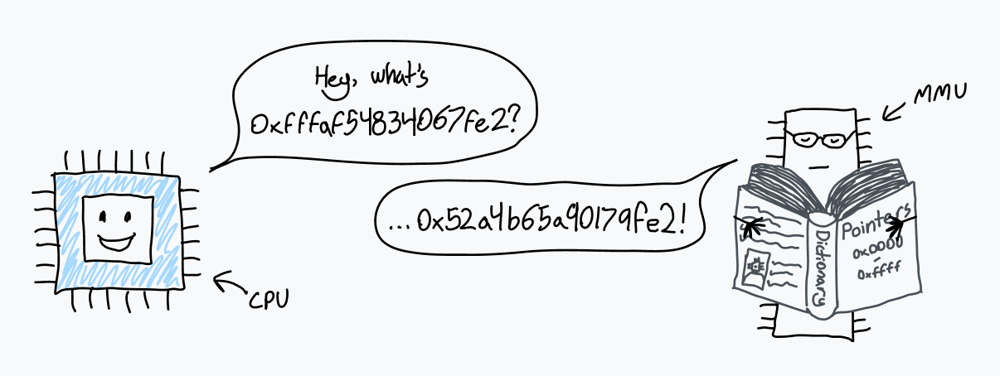
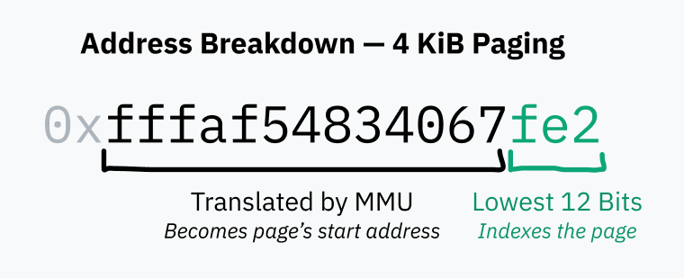
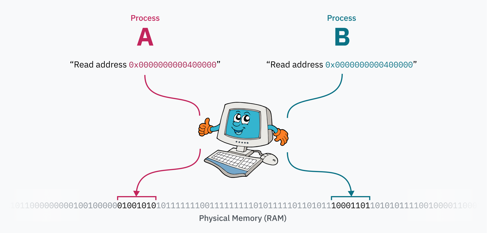
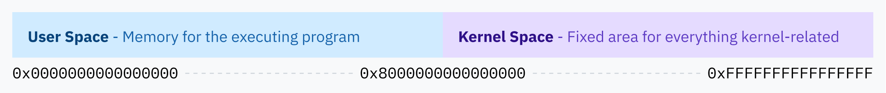
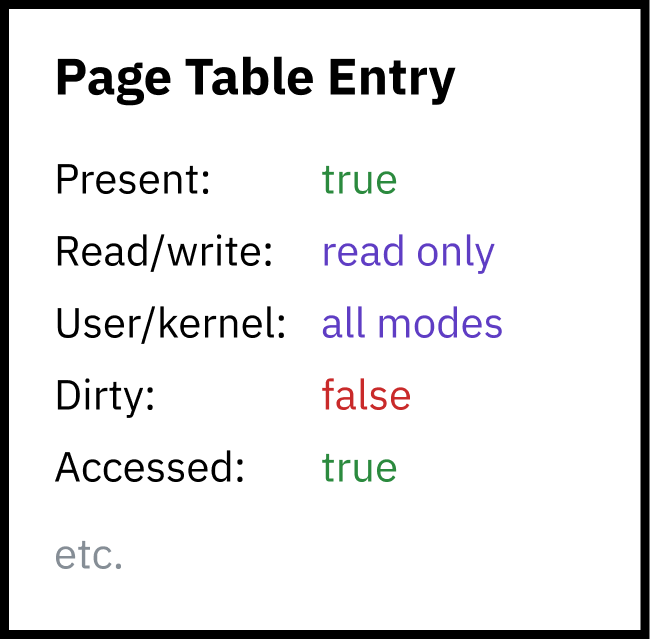
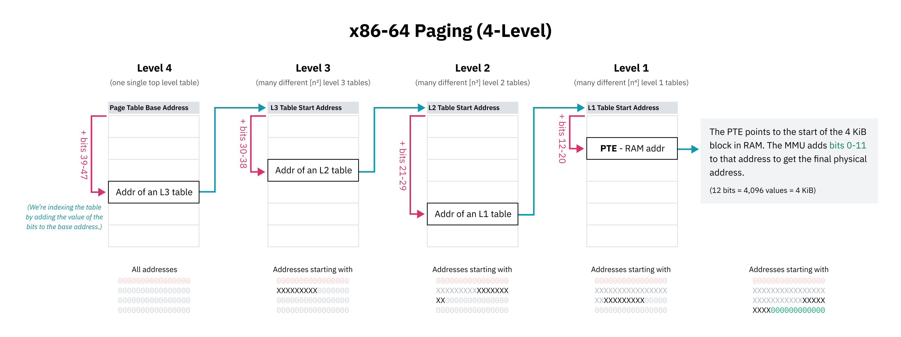

> [!IMPORTANT]
> この記事は[Putting the You in CPU](https://cpu.land/)の日本語訳です。原文は英語ですが、翻訳の過程で内容を少し変更したり、補足を加えたりしています。  
> MITライセンスで公開されている原文の内容は、[GitHub](https://github.com/hackclub/putting-the-you-in-cpu)で確認できます。  
> 著者、Kogniseとその他のHack Clubのメンバーに感謝します。  

---
<div class="grid2">
    <a href="4-becoming-an-elf-lord.md" class="button x-center">
    <- 4-becoming-an-elf-lord
    </a>
    <a href="6-lets-talk-about-forks-and-cows.md" class="button x-center">
    6-lets-talk-about-forks-and-cows ->
    </a>
</div>

---

ここまで、メモリの読み書きについて話すたびに、私は少し曖昧な言い方をしてきました。たとえばELFファイルは、データを読み込む具体的なメモリアドレスを指定します。それなのに、どうして別のプロセスどうしが同じアドレスを奪い合って問題にならないのでしょうか。なぜ各プロセスは、それぞれ別のメモリ環境を持っているように見えるのでしょう。

それに、そもそも私たちはどうやってここまで来たのでしょう。`execve` が現在のプロセスを新しいプログラムで *置き換える* システムコールだということはわかりました。でも、それでは複数のプロセスがどう始まるのかは説明できません。ましてや、いちばん最初のプログラムがどうやって動き始めるのかはなおさらです。最初のニワトリ（プロセス）は、どうやってほかの卵（別のプロセス）を産むのでしょう。

旅も終盤です。この2つの問いに答えられれば、コンピュータが起動から、いまあなたが使っているソフトウェアの実行に至るまでを、かなり一通り理解したことになります。

## メモリは見かけ倒しである

さて、メモリの話です。実はCPUがあるメモリアドレスを読み書きするとき、それは *物理* メモリ、つまりRAM上のその位置をそのまま指しているわけではありません。CPUが指しているのは、*仮想* メモリ空間上の位置です。
 
CPUは、[*memory management unit*](https://en.wikipedia.org/wiki/Memory_management_unit)、略してMMUと呼ばれるチップとやり取りします。MMUは、仮想メモリ上の位置をRAM上の位置へ変換する辞書を持つ翻訳者のようなものです。CPUが `0xfffaf54834067fe2` というメモリアドレスを読めという命令を受けると、MMUにそのアドレスの変換を頼みます。MMUは辞書を引き、対応する物理アドレスが `0x53a4b64a90179fe2` だと見つけて、その値をCPUへ返します。CPUはその後、その物理アドレスのRAMを読めるようになります。



コンピュータが最初に起動した直後は、メモリアクセスは直接物理RAMへ向かいます。起動してすぐにOSがこの変換辞書を作り、CPUにMMUを使い始めるよう指示します。

この辞書の正式名称は *ページテーブル* で、すべてのメモリアクセスを変換するこの仕組みを *ページング* と呼びます。ページテーブルの各項目は *ページ* と呼ばれ、それぞれが仮想メモリのある範囲をRAMのどこへ対応付けるかを表しています。こうした範囲の大きさは固定で、ページサイズはCPUアーキテクチャごとに異なります。x86-64の既定ページサイズは4 KiBなので、各ページは4,096バイトぶんのメモリブロックの対応を表します。

言い換えると、4 KiBページでは、アドレスの下位12ビットはMMUによる変換の前後で必ず同じです。4,096バイトのページ内位置を表すのに必要なビット数が12だからです。

x86-64では、OSがより大きい2 MiBページや4 GiBページを有効にすることもできます。これはアドレス変換速度を上げられる一方で、メモリ断片化や無駄を増やします。ページサイズが大きいほど、MMUが変換するアドレス部分は小さくなります。



ページテーブルそのものも、ただRAM上に置かれています。何百万もの項目を持ちうるとはいえ、各項目は数バイト程度なので、ページテーブル自体が占める容量はそこまで大きくありません。

起動時にページングを有効にするため、カーネルはまずRAM上にページテーブルを構築します。次に、その先頭の物理アドレスを page table base register（PTBR）と呼ばれるレジスタに入れます。最後にカーネルがページングを有効にし、すべてのメモリアクセスがMMUを通るようにします。x86-64では、制御レジスタ3（CR3）の上位20ビットがPTBRとして機能します。CR0の31ビット目、Pagingを表す PG ビットを1にすると、ページングが有効になります。

ページングがすごいのは、コンピュータが動いている最中にもページテーブルを書き換えられることです。これによって各プロセスは独立したメモリ空間を持てます。OSがあるプロセスから別のプロセスへコンテキストスイッチするとき、重要な仕事のひとつが、仮想メモリ空間を別の物理メモリ領域へ対応付け直すことなのです。たとえば2つのプロセスがあるとします。プロセスAのコードとデータ（おそらくELFから読み込まれたもの）は `0x0000000000400000` にあり、プロセスBもまったく同じ `0x0000000000400000` から自分のコードとデータへアクセスできます。両者は同じプログラムの別インスタンスであってもかまいません。実際にはそのアドレス帯を奪い合っていないからです。プロセスAのデータは、物理メモリ上ではプロセスBとはまるで違う場所にあり、カーネルがそのプロセスへ切り替えるときに `0x0000000000400000` へ対応付けているだけです。



> **余談: 呪われたELF豆知識**
>
> 状況によっては、`binfmt_elf` はメモリの最初のページをゼロでマップしなければなりません。ELFを最初にサポートした1988年のOS、UNIX System V Release 4.0（SVr4）向けに書かれた一部のプログラムが、ヌルポインタを読めることに依存しているからです。そしてどういうわけか、今でもその挙動に依存するプログラムがあります。
>
> これを実装したLinuxカーネル開発者は、どうやら[少しうんざりしていた](https://github.com/torvalds/linux/blob/22b8cc3e78f5448b4c5df00303817a9137cd663f/fs/binfmt_elf.c#L1322-L1329)ようです。
>
> *「なぜこんなことをするのか、だって？ SVr4はページ0を読み取り専用でマップしていて、それに“依存している”アプリケーションがある。こちらにはそれらを再コンパイルする力がないので、SVr4の挙動をエミュレートする。やれやれ。」*
>
> やれやれ、です。

## ページングによる保護

メモリページングによるプロセス分離は、コードを書く上でも便利です。各プロセスは他のプロセスの存在を意識せずにメモリを使えます。同時に、それは安全性も生み出します。プロセスは他のプロセスのメモリへアクセスできません。これで、記事の冒頭にあった疑問のひとつに半分答えられます。

> プログラムがCPU上で直接動いていて、CPUがRAMへ直接アクセスできるなら、なぜ他のプロセスのメモリや、ましてカーネルのメモリへは触れないのでしょうか。

*覚えていますか。ずいぶん前の話みたいに感じますが。*

ではカーネルメモリはどうでしょう。まず当然ながら、カーネル自身も、動いているプロセスを管理したりページテーブル自体を保持したりするために、たくさんのデータを持つ必要があります。ハードウェア割り込み、ソフトウェア割り込み、システムコールのたびにCPUがカーネルモードへ入るので、カーネルコードはそのメモリへ何らかの方法でアクセスできなければなりません。

Linuxの解決策は、仮想メモリ空間の上半分を常にカーネルへ割り当てることです。そのためLinuxは[*higher half kernel*](https://wiki.osdev.org/Higher_Half_Kernel)と呼ばれます。Windowsも[似た](https://learn.microsoft.com/en-us/windows-hardware/drivers/kernel/overview-of-windows-memory-space)仕組みを使っていますが、macOSは……[少し](https://www.researchgate.net/figure/Overview-of-the-Mac-OS-X-virtual-memory-system-which-resides-inside-the-Mach-portion-of_fig1_264086271) [もっと](https://developer.apple.com/library/archive/documentation/Performance/Conceptual/ManagingMemory/Articles/AboutMemory.html) [複雑](https://developer.apple.com/library/archive/documentation/Darwin/Conceptual/KernelProgramming/vm/vm.html)で、読んでいるうちに脳が耳から流れ出しそうでした。 \~(++)\~



もちろん、ユーザーランドのプロセスがカーネルメモリを読み書きできたら安全性は台無しです。そこでページングは第二の保護層も提供します。各ページには権限フラグを設定できるのです。あるフラグはその領域が書き込み可能か読み取り専用かを決めます。別のフラグは、その領域のメモリへアクセスできるのはカーネルモードだけだとCPUへ伝えます。この後者のフラグが higher half kernel 全体の保護に使われています。実際には、カーネルメモリ全体はユーザー空間プログラムの仮想メモリ対応表にも存在しています。ただし、アクセス権がないだけです。



ページテーブル自体も、実はカーネルメモリ空間の中にあります。タイマーチップがプロセス切り替え用のハードウェア割り込みを起こすと、CPUは特権レベルをカーネルモードへ切り替え、Linuxカーネルコードへ飛びます。カーネルモード（Intelでいう ring 0）にいることで、CPUはカーネル保護されたメモリ領域へアクセスできます。そこでカーネルは、上半分のどこかにあるページテーブルを書き換え、新しいプロセス向けに仮想メモリの下半分を再マップします。そして新しいプロセスへ切り替わってCPUがユーザーモードへ戻ると、もうカーネルメモリにはアクセスできません。

ほぼすべてのメモリアクセスはMMUを通ります。割り込み記述子テーブル内のハンドラポインタですら、指しているのはカーネルの仮想メモリ空間です。

## 階層ページングとその他の最適化

64ビットシステムのメモリアドレスは64ビット長です。つまり64ビット仮想メモリ空間は、実に16 [exbibytes](https://en.wiktionary.org/wiki/exbibyte) あります。これは途方もなく大きく、現在存在するどのコンピュータよりも、そして当分現れそうにないどのコンピュータよりもずっと大きいです。私が知る限り、史上最大級のRAMを積んだのは [Blue Waters スーパーコンピュータ](https://en.wikipedia.org/wiki/Blue_Waters)で、1.5ペタバイト超のRAMがありました。それでも16 EiBの0.01%未満です。

もし仮想メモリ空間の4 KiBごとにページテーブルエントリが必要だとすると、必要なエントリ数は 4,503,599,627,370,496 個です。1エントリ8バイトなら、ページテーブルだけで32 pebibytesものRAMが必要になります。コンピュータ史上最多RAM記録より、まだずっと大きいわけです。

> **余談: どうしてこんな変な単位なの？**
> 
> あまり一般的ではないし、見た目も少しごついのは承知していますが、バイナリ系のバイト単位（2の冪）とメートル系の単位（10の冪）は明確に区別したいと思っています。kilobyte、つまり kB はSI単位で1,000バイトです。kibibyte、つまり KiB はIEC推奨の単位で1,024バイトです。CPUやメモリアドレスの話では、コンピュータが2進法で動く以上、バイト数はふつう2の冪です。KB や、まして kB を1,024の意味で使うと曖昧になります。

仮想メモリ空間全体に対して、連番のページテーブルエントリをずらっと並べるのは不可能、少なくとも現実的ではありません。そこでCPUアーキテクチャは *階層ページング* を採用します。階層ページングでは、粒度の異なる複数段のページテーブルがあります。最上位のエントリは大きなメモリ範囲を担当し、より細かい範囲用のページテーブルを指します。こうして木構造ができます。4 KiBなり何なり、最終的なページサイズのブロックを表す個々のエントリが木の葉に当たります。

x86-64は長らく4段階の階層ページングを使ってきました。この仕組みでは、ページテーブルエントリは、そのテーブル先頭へアドレスの一部をオフセットとして足すことで見つかります。この一部は上位ビットから始まり、そのビット列が接頭辞として働くので、エントリはその接頭辞で始まる全アドレスを担当します。そのエントリはさらに次のレベルの表を指し、そこでも次のビット群で索引します。

x86-64の4段ページング設計者は、ページテーブル空間節約のため、仮想ポインタ上位16ビットを無視することも選びました。48ビットでも128 TiBの仮想アドレス空間が得られ、それで十分大きいと判断されたのです。（64ビット全部使うと16 EiBで、さすがに多すぎます。）

先頭16ビットを飛ばすので、ページテーブル第1段を引くための「最上位ビット」は、実際には63ビット目ではなく47ビット目から始まります。ということは、この章の earlier で出てきた higher half kernel の図は厳密には正確ではありません。カーネル空間の開始位置は、64ビット全部ではなく、もっと狭いアドレス空間の中央として描くべきでした。



階層ページングが容量問題を解決できるのは、木構造のどの段でも次を指すポインタがヌル (`0x0`) であってよいからです。これにより、ページテーブルの部分木全体をまるごと省略できます。つまり、未使用の仮想メモリ領域はRAM上で何も消費しません。マップされていないアドレスへのアクセスは、木の上の段で空エントリを見つけた時点でCPUがすぐ失敗にできるので、素早く弾けます。ページテーブルエントリには present フラグもあり、アドレスが見かけ上は正しくても使用不可と示せます。

階層ページングのもうひとつの利点は、仮想メモリ空間の大きな塊を効率よく差し替えられることです。広い仮想メモリ領域が、あるプロセスではある物理メモリ範囲へ、別のプロセスでは別の範囲へ対応しているかもしれません。カーネルは両方の対応表を保持しておき、プロセス切り替え時には木の上位ポインタだけを更新すれば済みます。もし全メモリ空間の対応が平坦な配列で保持されていたら、カーネルは大量のエントリを書き換えなければならず、遅いうえに、各プロセスの対応表も別途管理し続ける必要があります。

x86-64が「歴史的には」4段ページングだと書いたのは、最近のCPUが [5-level paging](https://en.wikipedia.org/wiki/Intel_5-level_paging) を実装しているからです。5段ページングでは間接参照がもう1段増え、さらに9ビット分アドレス空間が広がって、57ビットアドレスで128 PiBになります。5段ページングはLinuxを含むOSで [2017年以降](https://lwn.net/Articles/717293/) サポートされており、最近のWindows 10/11サーバ版でも利用されています。

> **余談: 物理アドレス空間の上限**
> 
> OSが仮想アドレスで64ビット全部を使わないのと同じように、CPUも物理アドレスで64ビット全部を使っているわけではありません。4段ページングが標準だった時代、x86-64 CPUは46ビットまでしか物理アドレスを使わず、物理アドレス空間は64 TiBに限られていました。5段ページングでは52ビットまで拡張され、4 PiBの物理アドレス空間を扱えます。
>
> OSの立場では、仮想アドレス空間は物理アドレス空間より大きいほうが都合がよいです。Linus Torvalds の[言葉](https://www.realworldtech.com/forum/?threadid=76912&curpostid=76973)を借りるなら、「少なくとも2倍は必要で、正直それでもかなりきつい。10倍以上あったほうがずっといい。これがわからないやつはどうかしている。以上。」です。

## スワップとデマンドページング

メモリアクセスが失敗する理由はいくつかあります。アドレス範囲外かもしれないし、ページテーブルに対応がないかもしれないし、対応先エントリが not present とされているかもしれません。こうした場合、MMUは *ページフォールト* と呼ばれるハードウェア割り込みを起こし、カーネルへ対処を委ねます。

読み出しが本当に不正、あるいは禁止されている場合もあります。そのときカーネルは、たいてい [segmentation fault](https://en.wikipedia.org/wiki/Segmentation_fault) エラーでそのプログラムを終了させます。

```
$ ./program
Segmentation fault (core dumped)
$
```

> **余談: segfaultという言葉の意味**
> 
> 「Segmentation fault」という言葉は、文脈によって意味が少し違います。MMUが権限なしメモリ読み出しで起こすハードウェア割り込みを指すこともあれば、OSが不正メモリアクセスを理由に実行中プログラムへ送る終了シグナルの名前を指すこともあります。

一方で、メモリアクセスを *意図的に* 失敗させることもあります。そうすればOSは必要なメモリをその場で用意し、その後 *もう一度CPUへ制御を返して再試行させる* ことができます。たとえばOSは、ディスク上のファイルを実際にはRAMへ読み込まずに仮想メモリへマップしておき、該当アドレスが要求されてページフォールトが起きた時点で物理メモリへ読み込めます。これが *デマンドページング* です。


これによって、たとえば [mmap](https://man7.org/linux/man-pages/man2/mmap.2.html) のように、ディスク上のファイル全体を遅延的に仮想メモリへマップするシステムコールが成立します。もしLLaMa.cpp、つまり流出したFacebook系言語モデル用ランタイムを知っているなら、Justine Tunney が最近 [読み込み処理を丸ごと mmap ベースに変える](https://justine.lol/mmap/)ことで大きな最適化をした話も面白いです。（彼女を知らなければ、[ぜひ見てみてください](https://justine.lol/)。Cosmopolitan Libc や APE はかなり面白く、この記事が好きならたぶん刺さります。）

> *どうやらこの変更へのJustineの関わりについては、[かなり](https://rentry.org/Jarted) [いろいろ](https://news.ycombinator.com/item?id=35413289) [揉め事](https://news.ycombinator.com/item?id=35458004)があるらしいです。知らずに書いたせいでインターネットの誰かに怒鳴られたくないので、一応書いておきます。正直その揉め事の大半は読んでいませんが、Justineの作るものが面白いという私の評価はまったく変わっていません。*

プログラムとそのライブラリを実行するとき、カーネルは実は最初からすべてをメモリへ読み込んでいるわけではありません。やっているのは、そのファイルの mmap を作ることだけです。CPUがそのコードを実行しようとした瞬間にページフォールトが起き、カーネルがそのページを本物のメモリブロックへ差し替えます。

デマンドページングは、あなたが「スワップ」や「ページング」という名前で見たことがあるはずの技法も可能にします。OSは、メモリページをディスクへ書き出し、物理メモリからは外しつつ、仮想メモリ上では present フラグを0にしたまま保持することで、物理メモリを空けられます。その仮想メモリが再び読まれたら、OSはディスクからRAMへ復元し、present フラグを1へ戻します。ディスクから読み込むメモリのために、別のRAM領域をさらに退避させる必要があるかもしれません。ディスクI/Oは遅いので、OSは[効率的なページ置換アルゴリズム](https://en.wikipedia.org/wiki/Page_replacement_algorithm)を使って、スワップがなるべく起きないよう工夫します。

少し面白いハックとして、ページテーブル中の「物理メモリへのポインタ欄」に、物理ストレージ上のファイル位置を入れてしまう方法があります。MMUは present フラグが立っていないのを見た時点でページフォールトを起こすので、それが本当のメモリアドレスでないこと自体は問題になりません。いつでも実用的というわけではありませんが、発想としてはかなり愉快です。

---
<div class="grid2">
    <a href="4-becoming-an-elf-lord.md" class="button x-center">
    <- 4-becoming-an-elf-lord
    </a>
    <a href="6-lets-talk-about-forks-and-cows.md" class="button x-center">
    6-lets-talk-about-forks-and-cows ->
    </a>
</div>

---
