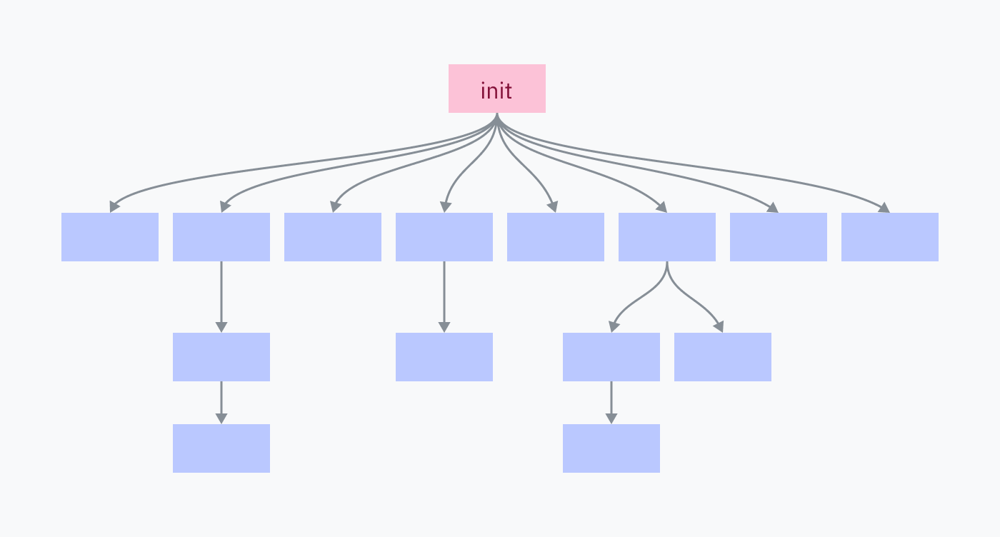

> [!IMPORTANT]
> この記事は[Putting the You in CPU](https://cpu.land/)の日本語訳です。原文は英語ですが、翻訳の過程で内容を少し変更したり、補足を加えたりしています。  
> MITライセンスで公開されている原文の内容は、[GitHub](https://github.com/hackclub/putting-the-you-in-cpu)で確認できます。
> 著者、Kogniseとその他のHack Clubのメンバーに感謝します。

---
<div class="grid2">
	<a href="5-the-translator-in-your-computer.md" class="button x-center">
	<- 5-the-translator-in-your-computer
	</a>
	<a href="7-epilogue.md" class="button x-center">
	7-epilogue ->
	</a>
</div>

---

最後の問いです。私たちは、そもそもどうやってここまで来たのでしょうか。最初のプロセスはどこから生まれるのでしょう。

この記事もほとんど終わりです。いよいよ最後の直線です。ホームラン目前です。いろいろひどい言い回しを並べるなら、とにかくあなたはもう「第6章ひとつ分」読むだけで、CPUアーキテクチャについて1万5千語の記事を読んでいないときにやっている何かへ戻れます。

`execve` が現在のプロセスを置き換えることで新しいプログラムを始めるのだとしたら、まったく別の新しいプロセスとしてプログラムを起動するにはどうすればいいのでしょうか。これはかなり重要な能力です。コンピュータで複数のことをしたいなら、アプリをダブルクリックしたとき、そのアプリが別個に立ち上がりつつ、もともと使っていたプログラムも動き続けてほしいからです。

答えは、もうひとつのシステムコール `fork` です。これはあらゆるマルチプロセシングの土台になっているシステムコールです。`fork` 自体は実はかなり単純で、現在のプロセスとそのメモリを複製し、保存されていた命令ポインタはそのままにして、両方のプロセスがそこから通常どおり進めるようにします。何もしなければ、2つのプログラムは独立して動き続け、計算は丸ごと二重になります。

新しく動き始めたプロセスは「子」、元々 `fork` を呼んだ側は「親」と呼ばれます。プロセスは `fork` を何度も呼べるので、子を複数持つこともできます。各子プロセスには *process ID*、つまりPIDが割り振られます。番号は1から始まります。

ただ同じコードを何も考えず倍にしても役に立たないので、`fork` は親と子で異なる値を返します。親側では新しい子プロセスのPIDを返し、子側では0を返します。これによって、新しいプロセス側で別の処理を行えるようになり、forkが実際に役立つものになります。

```c
pid_t pid = fork();

// ここから先のコードは通常どおり続くが、ただし今は
// 2つの「同一な」プロセスで走る。
//
// 同一……と言いたいところだが、fork が返す PID だけは違う。
//
// それこそが、自分が唯一の存在ではないと
// どちらのプログラムにも知らせる唯一の手掛かりだ。

if (pid == 0) {
	// こちらは子プロセス。
	// 何か計算して、結果を親へ渡そう。
} else {
	// こちらは親プロセス。
	// たぶん今までどおりの仕事を続ける。
}
```

プロセスのforkは少し頭の中で掴みにくい概念です。ここから先は、ひとまずイメージできた前提で進めます。もしまだ腑に落ちていなければ、[この見た目はだいぶ年季の入ったサイト](https://www.csl.mtu.edu/cs4411.ck/www/NOTES/process/fork/create.html)がかなりよく説明してくれています。

ともあれ、Unix系のプログラムは `fork` を呼び、直後に子プロセス側で `execve` を実行することで新しいプログラムを起動します。これを *fork-exec パターン* と呼びます。あなたがプログラムを起動すると、コンピュータはだいたい次のようなコードを実行しています。

```c
pid_t pid = fork();

if (pid == 0) {
	// 子プロセスをすぐ新しいプログラムへ置き換える。
	execve(...);
}

// ここへ来たということは、プロセスは置き換わっていない。つまり親側だ。
// 便利なことに、新しい子プロセスの PID も pid 変数に入っているので、
// 必要なら後で kill できる。

// 親プログラムはここから続く……
```

## モーーー！

プロセスのメモリを丸ごと複製しておいて、直後に別プログラムを読み込むとき全部捨てる、というのは少し非効率に見えるはずです。幸い、私たちにはMMUがあります。遅いのは物理メモリ上のデータ複製であって、ページテーブル複製ではありません。だから実際には、RAMは *複製しません*。古いプロセスのページテーブルだけを新しいプロセス用に複製し、その対応先は同じ物理メモリを指し続けます。

ただし子プロセスは、親から独立していて隔離されていなければなりません。子が親のメモリを書き換えても困るし、その逆も困ります。

そこで登場するのが *COW*（copy on write）ページです。COWページでは、どちらのプロセスもメモリへ書き込もうとしない限り、同じ物理アドレスを共有して読み取ります。片方が書き込もうとした瞬間、そのページだけがRAM上で複製されます。COWページのおかげで、両プロセスはメモリ分離を保ちながら、最初にメモリ空間全体を複製するコストを払わずに済みます。fork-exec パターンが効率的なのはこのためです。新しいバイナリを読み込む前に古いメモリへ書き込むことはないので、実際にはほとんど何もコピーしなくて済みます。

COWもまた、多くの面白い仕掛けと同じく、ページングの小技とハードウェア割り込み処理で実現されています。`fork` が親を複製したあと、カーネルは親子両方の全ページを読み取り専用としてマークします。プログラムがそこへ書き込もうとすると、メモリは読み取り専用なので失敗します。これで segfault（ハードウェア割り込みの意味でのもの）が発生し、カーネルがそれを処理します。カーネルはメモリを複製し、そのページを書き込み可能へ更新し、割り込みから戻って書き込みをやり直させます。

> *A: Knock, knock!  
> B: Who's there?  
> A: Interrupting cow.  
> B: Interrupting cow wh —  
> A: **MOOOOO!***

> *A: ノックノック。  
> B: どちらさま？  
> A: Interrupting cow。  
> B: Interrupting cow って、な……  
> A: **モーーー！***

## はじめに（創世記1章1節の話ではない）

あなたのコンピュータ上のすべてのプロセスは、ひとつを除いて親プログラムによる fork-exec で生まれています。その例外が *init process* です。initプロセスだけは、カーネルが直接、手で立ち上げます。これは最初に動くユーザーランドプログラムであり、終了時には最後に止まるものでもあります。

一瞬で画面を真っ黒にする派手な実演が見たいですか。macOSやLinuxを使っているなら、作業を保存してから端末を開き、initプロセス（PID 1）を kill してみてください。

```
$ sudo kill 1
```

> *著者注: 残念ながら、initプロセスに関する知識はmacOSやLinuxのようなUnix系システムにしかほぼ当てはまりません。ここから先に学ぶことの多くは、かなり異なるカーネルアーキテクチャを持つWindowsの理解にはそのまま使えません。*
> 
> *`execve` の章でも触れたとおり、この点は意識的に切り分けています。NTカーネルだけで別の記事を丸ごと1本書けてしまうのですが、今はまだ自制しています。（いまのところは。）*

initプロセスは、OSを構成する各種プログラムやサービスを立ち上げる役目を担います。そしてそれらの多くが、さらに自分のサービスやプログラムを起動していきます。



initプロセスを殺すと、その子も、そのまた子も、連鎖的に全部落ちるので、OS環境そのものが止まります。

## カーネルへ戻る

[第3章](/how-to-run-a-program)ではLinuxカーネルコードを見るのがかなり楽しかったので、ここでももう少し続けましょう。今回は、カーネルがinitプロセスをどう始めるかから見ていきます。

コンピュータは、おおむね次のような流れで起動します。

1. マザーボードには、ごく小さなソフトウェアが組み込まれています。これは接続されたディスクを探し、*bootloader* と呼ばれるプログラムを見つけます。見つけたブートローダの機械語をRAMへ読み込み、実行します。
	
	この時点では、まだOSが動いている世界には入っていません。OSカーネルがinitプロセスを開始するまでは、マルチプロセシングもシステムコールも本当の意味では存在しません。pre-initの文脈で「プログラムを実行する」とは、戻ることを前提とせず、その機械語へRAM上で直接ジャンプすることを意味します。
2. ブートローダは、カーネルを見つけてRAMへ読み込み、実行する責任を持ちます。[GRUB](https://www.gnu.org/software/grub/) のように設定可能だったり、複数OSから選ばせたりするものもあります。BootX と Windows Boot Manager は、それぞれmacOSとWindowsに組み込まれたブートローダです。
3. ここでカーネルが動き始め、割り込みハンドラの設定、ドライバ読み込み、初期メモリマッピングの作成など、大量の初期化処理に入ります。最後にカーネルは特権レベルをユーザーモードへ切り替え、initプログラムを始めます。
4. これでようやく、OS上のユーザーランドに到達です。initプログラムは init スクリプトを実行し、サービスを立ち上げ、シェルやUIのようなプログラムを起動し始めます。

### Linuxの初期化

Linuxでは、ステップ3の大部分、つまりカーネル初期化の本体は [init/main.c](https://github.com/torvalds/linux/blob/22b8cc3e78f5448b4c5df00303817a9137cd663f/init/main.c) にある `start_kernel` 関数で行われます。この関数は、さまざまな初期化関数呼び出しが200行以上続く巨大なものなので、[全文](https://github.com/torvalds/linux/blob/22b8cc3e78f5448b4c5df00303817a9137cd663f/init/main.c#L880-L1091)は載せませんが、一度ざっと眺めてみることは強く勧めます。`start_kernel` の最後では `arch_call_rest_init` という関数が呼ばれます。

```c
	/* Do the rest non-__init'ed, we're now alive */
	arch_call_rest_init();
```

> **non-\_\_init'ed とは何か？**
>
> `start_kernel` 関数は `asmlinkage __visible void __init __no_sanitize_address start_kernel(void)` と定義されています。`__visible`、`__init`、`__no_sanitize_address` のような妙なキーワードは、Linuxカーネルで使われるCプリプロセッサマクロで、関数へさまざまな性質やコード生成指定を付与します。
> 
> この場合、`__init` は、起動処理が終わったらその関数と関連データをメモリから解放せよ、とカーネルに指示するマクロです。単純に容量節約のためです。
>
> どうやって実現しているのでしょう。細部に入りすぎない範囲で言うと、Linuxカーネル自体もELFファイルとして構成されています。`__init` マクロは `__section(".init.text")` に展開され、通常の `.text` ではなく `.init.text` というsectionへコードを置くようコンパイラへ指示します。同様に `__initdata` が `__section(".init.data")` に展開されるように、データや定数を特別な init section へ置くマクロもあります。

`arch_call_rest_init` は単なるラッパー関数です。

```c
void __init __weak arch_call_rest_init(void)
{
	rest_init();
}
```

コメントが「残りは non-\_\_init'ed でやる」と言っていたのは、`rest_init` が `__init` マクロ付きで定義されていないからです。つまり init メモリを掃除するときにも解放されません。

```c
noinline void __ref rest_init(void)
{
```

`rest_init` はここで init プロセス用のスレッドを作ります。

```c
	/*
	 * We need to spawn init first so that it obtains pid 1, however
	 * the init task will end up wanting to create kthreads, which, if
	 * we schedule it before we create kthreadd, will OOPS.
	 */
	pid = user_mode_thread(kernel_init, NULL, CLONE_FS);
```

`user_mode_thread` に渡されている `kernel_init` は、残りの初期化作業を終えたあと、実行可能なinitプログラムを探して起動する関数です。この処理もいくつか基本的な準備から始まりますが、大半は省略します。例外は `free_initmem` が呼ばれる箇所です。ここでカーネルは `.init` section を解放します。

```c
	free_initmem();
```

これで、カーネルは適切なinitプログラムを探して実行できます。

```c
	/*
	 * We try each of these until one succeeds.
	 *
	 * The Bourne shell can be used instead of init if we are
	 * trying to recover a really broken machine.
	 */
	if (execute_command) {
		ret = run_init_process(execute_command);
		if (!ret)
			return 0;
		panic("Requested init %s failed (error %d).",
		      execute_command, ret);
	}

	if (CONFIG_DEFAULT_INIT[0] != '\0') {
		ret = run_init_process(CONFIG_DEFAULT_INIT);
		if (ret)
			pr_err("Default init %s failed (error %d)\n",
			       CONFIG_DEFAULT_INIT, ret);
		else
			return 0;
	}

	if (!try_to_run_init_process("/sbin/init") ||
	    !try_to_run_init_process("/etc/init") ||
	    !try_to_run_init_process("/bin/init") ||
	    !try_to_run_init_process("/bin/sh"))
		return 0;

	panic("No working init found.  Try passing init= option to kernel. "
	      "See Linux Documentation/admin-guide/init.rst for guidance.");
```

Linuxでは、initプログラムはほぼ常に `/sbin/init` にあるか、そこへシンボリックリンクされています。代表的なinit実装には、[systemd](https://systemd.io/)（異様に出来のいいサイトを持っています）、[OpenRC](https://wiki.gentoo.org/wiki/OpenRC/openrc-init)、[runit](http://smarden.org/runit/) などがあります。`kernel_init` は他に何も見つからなければ `/bin/sh` を使います。そして `/bin/sh` すら見つからないなら、かなり本気で何かが壊れています。

*macOSにもinitプログラムはあります。名前は launchd で、場所は `/sbin/launchd` です。端末から実行すると、「お前はカーネルではない」と怒られます。*

ここから先は起動手順のステップ4です。initプロセスがユーザーランドで動き始め、fork-exec パターンを使ってさまざまなプログラムを起動していきます。

### fork時のメモリマッピング

fork時にLinuxカーネルがメモリ下半分をどう再マップするのか気になったので、少し追ってみました。[kernel/fork.c](https://github.com/torvalds/linux/blob/22b8cc3e78f5448b4c5df00303817a9137cd663f/kernel/fork.c) に、プロセスforkの主要部分がまとまっているようです。その冒頭コメントが、ちょうど見るべき場所を教えてくれました。

```c
/*
 *  'fork.c' contains the help-routines for the 'fork' system call
 * (see also entry.S and others).
 * Fork is rather simple, once you get the hang of it, but the memory
 * management can be a bitch. See 'mm/memory.c': 'copy_page_range()'
 */
```

この `copy_page_range` 関数は、メモリマッピングに関する情報を受け取り、ページテーブルを複製しているようです。そこから呼ばれる関数をざっと追うと、ページを読み取り専用にしてCOWページ化する処理もここで行われています。その判定には `is_cow_mapping` という関数が使われています。

`is_cow_mapping` は [include/linux/mm.h](https://github.com/torvalds/linux/blob/22b8cc3e78f5448b4c5df00303817a9137cd663f/include/linux/mm.h) で定義されていて、そのメモリマッピングが書き込み可能かつプロセス間共有ではないことを示す[フラグ](http://books.gigatux.nl/mirror/kerneldevelopment/0672327201/ch14lev1sec2.html)を持っていれば true を返します。共有メモリは、そもそも共有されるためのものなのでCOW化する必要がありません。少し読みにくいビットマスク計算をご覧ください。

```c
static inline bool is_cow_mapping(vm_flags_t flags)
{
	return (flags & (VM_SHARED | VM_MAYWRITE)) == VM_MAYWRITE;
}
```

[kernel/fork.c](https://github.com/torvalds/linux/blob/22b8cc3e78f5448b4c5df00303817a9137cd663f/kernel/fork.c) に戻って `copy_page_range` を検索すると、`dup_mmap` から呼ばれているのが見つかります。`dup_mmap` は `dup_mm` から、`dup_mm` は `copy_mm` から、そして `copy_mm` は巨大な `copy_process` 関数から呼ばれています。`copy_process` こそ fork の中核であり、ある意味ではUnix系システムがプログラムを実行する仕組みの中心でもあります。起動時に作られた最初のプロセスという雛形を、ずっと複製し、少しずつ書き換え続けているわけです。

[牛の動画](https://www.youtube.com/embed/FavUpD_IjVY)

## まとめ

***では結局、プログラムはどう動くのでしょうか。***

いちばん低いレベルで言えば、プロセッサは単純です。メモリ中のある位置を指すポインタを持ち、別の場所へ飛べという命令に出会わない限り、命令を順番に実行していきます。

ジャンプ命令に加えて、ハードウェア割り込みとソフトウェア割り込みも、あらかじめ決められた場所へ飛ぶことで実行の流れを断ち切れます。その先では、さらに別の場所へ飛ぶ判断ができます。プロセッサコアは一度に複数のプログラムを本当に同時実行することはできませんが、タイマーで繰り返し割り込みを起こし、カーネルコードに複数のコードポインタを切り替えさせることで、そのように見せかけられます。

プログラムは、自分が一貫した独立単位として動いていると *思い込まされて* います。ユーザーモードではシステム資源への直接アクセスが禁じられ、メモリ空間はページングで分離され、システムコールは真の実行文脈をあまり知らなくても汎用的なI/Oを可能にするよう設計されています。システムコールとは、起動時にカーネルが設定した場所にあるカーネルコードを実行してくれとCPUへ頼む命令です。

***でも、そのプログラムたちはどうやって始まるのでしょうか。***

コンピュータが起動すると、カーネルはinitプロセスを始めます。これは、機械語がシステムの細かな事情をいちいち気にしなくてよい、より高い抽象レベルで走る最初のプログラムです。initプログラムは、グラフィカルな環境を構成するプログラムや、他のソフトウェアを起動する責任を持つプログラムを立ち上げていきます。

プログラムを起動するには、まず `fork` システムコールで自分自身を複製します。この複製が効率的なのは、メモリページがCOWになっており、物理RAM上のメモリをその場でコピーする必要がないからです。Linuxでは、これを実際に担っているのが `copy_process` 関数です。

そして親子両方のプロセスが、自分が fork された側かどうかを確認します。もしそうなら、exec系システムコールを使って、現在のプロセスを新しいプログラムで置き換えてくれとカーネルへ依頼します。

その新しいプログラムはたぶんELFファイルです。カーネルはそれを解析し、どう読み込み、新しい仮想メモリ対応表のどこへコードやデータを置くべきかを調べます。プログラムが動的リンクされていれば、ELF interpreter も準備するかもしれません。

最後にカーネルは、そのプログラム用の仮想メモリ対応を読み込み、プログラムが動いている状態でユーザーランドへ戻れます。実際にそれが意味するのは、CPUの命令ポインタを仮想メモリ内にある新しいプログラムの先頭へ合わせることです。

---
<div class="grid2">
	<a href="5-the-translator-in-your-computer.md" class="button x-center">
	<- 5-the-translator-in-your-computer
	</a>
	<a href="7-epilogue.md" class="button x-center">
	7-epilogue ->
	</a>
</div>

---
