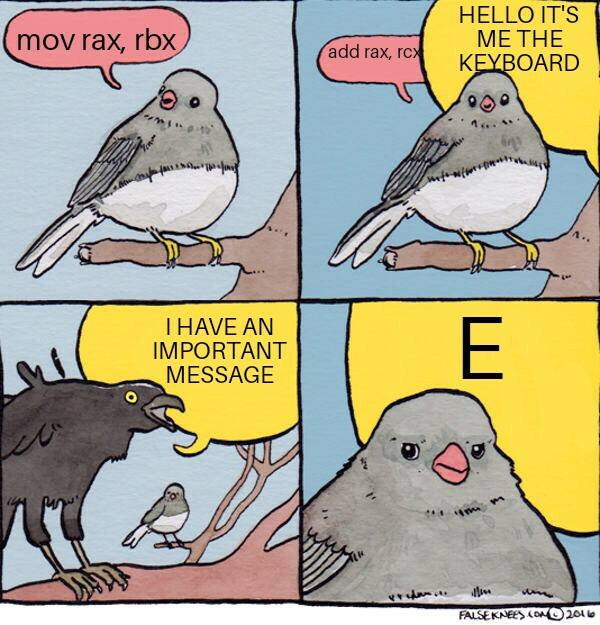

> [!IMPORTANT]
> この記事は[Putting the You in CPU](https://cpu.land/)の日本語訳です。原文は英語ですが、翻訳の過程で内容を少し変更したり、補足を加えたりしています。  
> MITライセンスで公開されている原文の内容は、[GitHub](https://github.com/hackclub/putting-the-you-in-cpu)で確認できます。  
> 著者、Kogniseとその他のHack Clubのメンバーに感謝します。  

---

    <a href="6-lets-talk-about-forks-and-cows.md" class="button x-center">
    <- 6-lets-talk-about-forks-and-cows
    </a>
    <a href="./" class="button x-center">
    0-introduction ->
    </a>

---

これでついに、CPUの中に「あなた」をしっかり置くことができました。楽しんでもらえていたらうれしいです。

最後にもう一度強調しておきたいのは、ここまでで得た知識はどれも現実に動いている生きた仕組みだということです。次に「自分のコンピュータはどうやって複数アプリを動かしているのだろう」と考えたとき、頭の中にタイマーチップとハードウェア割り込みが浮かぶようになっていたらうれしいです。何か洒落たプログラミング言語でコードを書いていてリンカエラーが出たとき、そのリンカが何をしようとしているのかを思い出してもらえたらと思います。

この記事の内容について質問や訂正があれば、[lexi@hackclub.com](mailto:lexi@hackclub.com) までメールするか、[GitHub](https://github.com/hackclub/putting-the-you-in-cpu/) で issue や PR を送ってください。

……でも、まだ少し続きがあります。

## おまけ: Cの概念を言い換える

低レベルプログラミングをしたことがあるなら、スタックとヒープが何かはたぶん知っているでしょうし、`malloc` も使ったことがあるでしょう。ただ、それらがどう実装されているかまでは、あまり考えたことがないかもしれません。

まず、スレッドのスタックは、仮想メモリのかなり高い位置へマップされた固定量のメモリです。多くの（ただし[すべてではない](https://stackoverflow.com/a/664779)）アーキテクチャでは、スタックポインタはスタック領域の上端から始まり、増減の方向としては下へ向かって動きます。物理メモリは、マップされたスタック空間全体に対して最初から確保されているわけではありません。代わりにデマンドページングが使われ、スタックフレームが実際に到達したぶんだけ、遅延的にメモリが確保されます。

意外かもしれませんが、`malloc` のようなヒープ確保関数はシステムコールではありません。ヒープメモリ管理は libc の実装が提供しています。`malloc`、`free` などはそれ自体がかなり複雑な手続きで、libc がメモリマッピングの詳細を自分で追跡しています。裏側では、ユーザーランドのヒープアロケータが `mmap`（ファイル以外もマップできます）や `sbrk` を含むシステムコールを使っています。

## おまけ: 小ネタ集

うまく収まる場所が見つからなかったけれど、面白いので載せておきたい話をここに置いておきます。

> *たいていのLinuxユーザーは、おそらく十分に興味深い人生を送っているので、カーネル内でページテーブルがどう表現されているかを想像する時間はあまり持たない。*
> 
> *<cite>[Jonathan Corbet, LWN](https://lwn.net/Articles/106177/)</cite>*

ハードウェア割り込みの別のイメージ図です。

ちなみに、一部のシステムコールはカーネル空間へ飛び込む代わりに、vDSO と呼ばれる仕組みを使います。今回はそこまで触れる時間がありませんでしたが、かなり面白い話題なので、[ぜひ](https://en.wikipedia.org/wiki/VDSO) [読んで](https://man7.org/linux/man-pages/man7/vdso.7.html) [みてください](https://0xax.gitbooks.io/linux-insides/content/SysCall/linux-syscall-3.html)。

最後に、Unix寄りすぎるという指摘について。実行まわりの話の多くがかなりUnix寄りなのは、やはり少し申し訳なく思っています。macOSやLinuxユーザーなら問題ありませんが、Windowsがプログラムをどう実行し、どうシステムコールを扱うのかを理解するうえでは、そこまで直接の助けにはなりません。もっとも、CPUアーキテクチャそのものの話は共通です。いずれはWindows側の世界を扱う記事も書いてみたいと思っています。

## 謝辞

この記事を書いている間、GPT-3.5 と GPT-4 にもかなり相談しました。かなりの頻度で嘘をつかれたし、情報の大半は役に立ちませんでしたが、ときどき問題を考え抜く助けにはなってくれました。LLMの支援は、限界を理解し、言うことをすべて強く疑うのであれば、差し引きでプラスになりえます。ただし、文章を書かせるのは本当にだめです。書かせないでください。

それより何より、校正してくれたり、励ましてくれたり、アイデア出しを手伝ってくれたりしたすべての人間たちに感謝します。特に Ani、B、Ben、Caleb、Kara、polypixeldev、Pradyun、Spencer、Nicky（[第4章](/becoming-an-elf-lord) のすばらしいエルフを描いてくれました）、そして大好きな両親に。

もしあなたがティーンエイジャーで、コンピュータが好きで、まだ [Hack Club Slack](https://hackclub.com/slack) に入っていないなら、今すぐ参加するべきです。考えや進捗を共有できる最高のコミュニティがなければ、私はこの記事を書けなかったと思います。もしティーンエイジャーでないなら、私たちが面白いことを続けられるように [お金をください](https://hackclub.com/philanthropy/)。

この記事のほどほどな出来の絵は、すべて [Figma](https://figma.com/) で描きました。編集には [Obsidian](https://obsidian.md/) を使い、ときどき [Vale](https://vale.sh/) でlintもかけていました。この記事のMarkdownソースは [GitHub](https://github.com/hackclub/putting-the-you-in-cpu/) で公開されており、将来の細かな指摘も歓迎しています。また、すべての絵は [Figma Community page](https://www.figma.com/community/file/1260699047973407903) に公開しています。

---

    <a href="6-lets-talk-about-forks-and-cows.md" class="button x-center">
    <- 6-lets-talk-about-forks-and-cows
    </a>
    <a href="./" class="button x-center">
    0-introduction ->
    </a>

---
