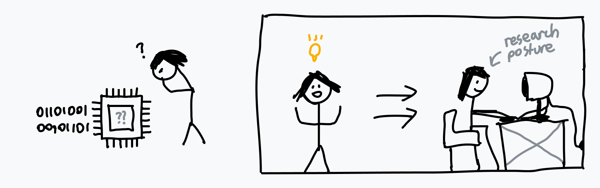

> [!IMPORTANT]
> この記事は[Putting the You in CPU](https://cpu.land/)の日本語訳です。原文は英語ですが、翻訳の過程で内容を少し変更したり、補足を加えたりしています。  
> MITライセンスで公開されている原文の内容は、[GitHub](https://github.com/hackclub/putting-the-you-in-cpu)で確認できます。  
> 著者、Kogniseとその他のHack Clubのメンバーに感謝します。  

私は[コンピュータでいろいろなこと](https://github.com/kognise)をやってきましたが、ずっと知識の穴として残っていたことがありました。自分のコンピュータでプログラムを実行するとき、実際には何が起きているのか、ということです。この穴のことは前から気になっていて、必要な低レベルの知識はかなり持っていたのですが、それらをひとつの流れとして結びつけるのが難しかったのです。プログラムは本当にCPUの上でそのまま実行されているのか、それとも別の何かが挟まっているのか。システムコールは使ったことがあるけれど、あれはいったいどう *動く* のか。そもそも、あれは何なのか。複数のプログラムはどうやって同時に動いているのか。

そこで腹をくくって、わかる限り全部調べることにしました。大学に行かないなら、システムまわりを体系的に学べる資料はあまり多くありません。だから、質もまちまちで、ときには互いに食い違う大量の情報源をひたすら読み比べるしかありませんでした。数週間の調査と40ページ近いメモを経て、起動からプログラム実行に至るまでコンピュータがどう動いているのか、かなり見通せるようになったと思います。自分が学んだことを一つにまとめて説明してくれる記事が本当にほしかったので、今それを自分で書いています。

それに、よく言うでしょう。誰かに説明できてはじめて、本当に理解したと言えるのだと。

> 急いでいますか？ あるいは、もうこのへんは知っている気がしますか？
>
> それなら[第3章](3-how-to-run-a-program.md)から読んでください。何かひとつは必ず新しく学べるはずです。まあ、本人がLinus Torvalds(Linuxなどの作者)なら話は別ですが。