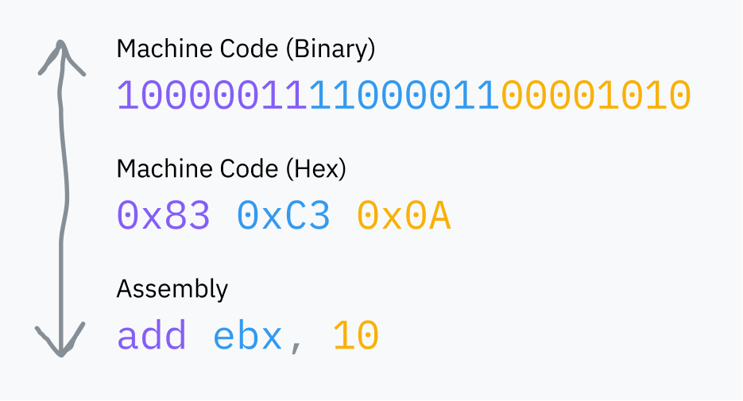
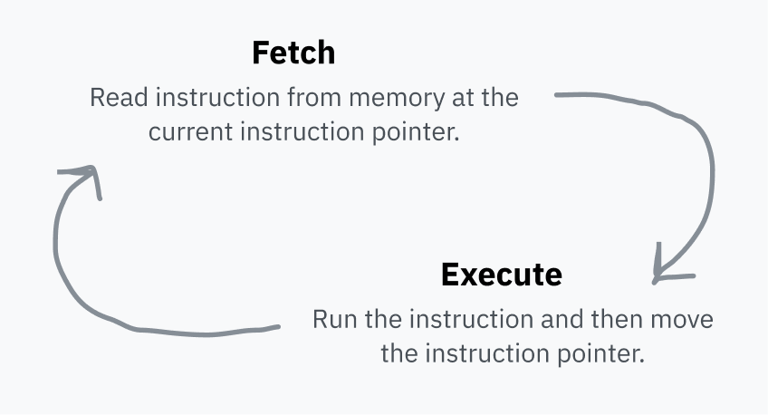
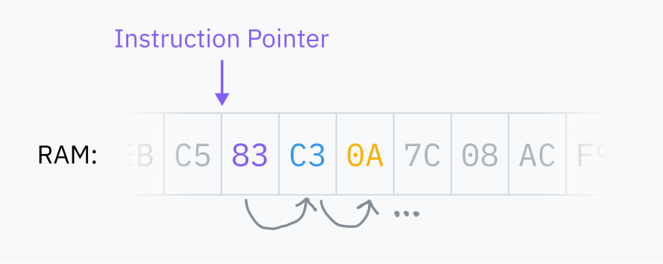
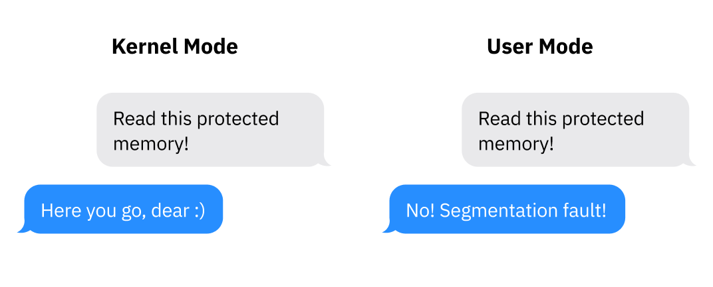
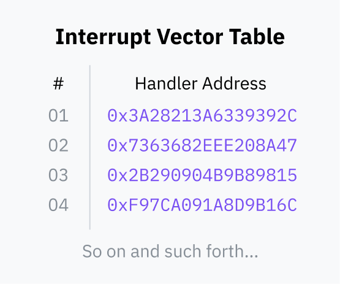
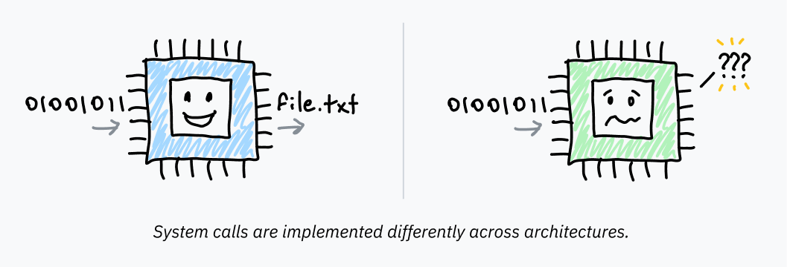

> [!IMPORTANT]
> この記事は[Putting the You in CPU](https://cpu.land/)の日本語訳です。原文は英語ですが、翻訳の過程で内容を少し変更したり、補足を加えたりしています。  
> MITライセンスで公開されている原文の内容は、[GitHub](https://github.com/hackclub/putting-the-you-in-cpu)で確認できます。  
> 著者、Kogniseとその他のHack Clubのメンバーに感謝します。  

---

  <a href="./" class="button x-center">
  <- 0-introduction
  </a>  
  <a href="2-slice-dat-time.md" class="button x-center">
  2-slice-dat-time ->
  </a>  

---

この記事を書きながら何度も驚かされたのは、コンピュータがいかに *単純* かということでした。実際以上の複雑さや抽象化をつい想定してしまう癖は、今でもなかなか抜けません。先に進む前にひとつだけ頭に焼き付けてほしいことがあります。単純そうに見えるものは、本当にそのまま単純だということです。この単純さはとても美しく、ときにはとても、とても厄介でもあります。

まずは、コンピュータがいちばん根っこのところでどう動いているのか、その基本から始めましょう。

## コンピュータの基本構造

コンピュータの *central processing unit*、つまりCPUは、あらゆる計算を担当しています。いちばん偉いやつです。主役です。コンピュータの電源を入れた瞬間から、命令をひとつ、またひとつ、そのまたひとつと、延々実行し続けます。

最初に量産されたCPUは、1960年代後半にイタリアの物理学者兼エンジニア、Federico Fagginが設計した[Intel 4004](http://www.intel4004.com/)です。これは、現在一般的な[64ビット](https://en.wikipedia.org/wiki/64-bit_computing)ではなく4ビットのアーキテクチャでした。現代のプロセッサよりずっと単純でしたが、その単純さの多くは今でも受け継がれています。

CPUが実行している「命令」は、ただのバイナリデータです。どの命令を実行するかを表す1バイトか2バイトほどの情報、つまりオペコードがあり、その後ろに命令の実行に必要なデータが続きます。私たちが *機械語* と呼ぶものは、そうしたバイナリ命令が並んだものにすぎません。[アセンブリ](https://en.wikipedia.org/wiki/Assembly_language)は、その機械語を人間が読み書きしやすくするための記法です。最終的には、CPUが読めるバイナリへ必ず変換されます。

> 余談ですが、命令が常に上の例のように機械語と1対1で対応するわけではありません。たとえば `add eax, 512` は `05 00 02 00 00` に変換されます。
> 
> 最初の1バイト (`05`) は、*EAXレジスタに32ビット整数を加算する* ことを表す専用のオペコードです。残りのバイトは、[リトルエンディアン](https://en.wikipedia.org/wiki/Endianness)で表現された512 (`0x200`) です。
>
> Defuse Security が、アセンブリと機械語の変換を試せる[便利なツール](https://defuse.ca/online-x86-assembler.htm)を公開しています。

RAMは、コンピュータの主記憶装置です。コンピュータ上で動いているプログラムが使うあらゆるデータを置いておく、大きな汎用スペースです。そこにはプログラム自身のコードもあれば、OSの中核部分のコードもあります。CPUは常にRAMから機械語を直接読み取ります。RAMに載っていないコードは実行できません。

CPUは *命令ポインタ* を持っていて、次に取り出す命令がRAMのどこにあるかを指しています。命令をひとつ実行するたびに、CPUはそのポインタを進め、同じことを繰り返します。これが *フェッチ・実行サイクル* です。

命令を実行すると、命令ポインタはRAM上でその命令の直後へ進み、次の命令を指すようになります。コードが動く理由はそれです。命令ポインタがひたすら前へ進み、メモリに並んだ順番どおりに機械語を実行していくのです。ただし、一部の命令は命令ポインタに別の場所へ飛べと指示したり、条件によって飛び先を変えたりできます。これによって、再利用可能なコードや条件分岐が実現できます。

この命令ポインタは、[*レジスタ*](https://en.wikipedia.org/wiki/Processor_register)と呼ばれる場所に格納されています。レジスタは、CPUが非常に高速に読み書きできる小さな記憶領域です。CPUアーキテクチャごとに使えるレジスタの組は決まっていて、計算中の一時値の保存からCPU設定の保持まで、さまざまな用途に使われます。

レジスタの中には、先ほどの図に出てきた `ebx` のように、機械語から直接アクセスできるものもあります。

別のレジスタはCPU内部でのみ使われますが、専用の命令を通じて更新したり読み取ったりできることがよくあります。命令ポインタがその一例で、直接読むことはできませんが、たとえばジャンプ命令で更新できます。

## プロセッサは驚くほど素朴

最初の問いに戻りましょう。実行可能なプログラムをコンピュータで起動すると、何が起きるのでしょうか。最初に、それを実行できる状態にするためのいろいろな下準備が入ります。そこはあとで順に見ます。ただ、その処理の最後には、どこかのファイルの中に機械語があるわけです。OSはそれをRAMへ読み込み、命令ポインタをその場所へ飛ばすようCPUに指示します。CPUはいつもどおりフェッチ・実行サイクルを続けるので、その結果としてプログラムの実行が始まります。

（ここは私にとっても「勝手に話を大きく考えすぎていた」と気づかされた瞬間のひとつでした。本当に、いまこの文章を読むのに使っているプログラムも、こうやって動いています。CPUがRAMからブラウザの命令を順に取り出して直接実行し、その結果としてこのページが描画されているのです。）

CPUの見ている世界は、実はものすごく単純です。CPUが見ているのは、現在の命令ポインタと少しばかりの内部状態だけです。プロセスというものは、完全にOS側の抽象であって、CPUが生まれつき理解していたり追跡していたりする対象ではありません。

*\*身振り手振りしながら\* プロセスなんてものは、~~OS開発者~~ 巨大バイト産業がもっとコンピュータを売るために作り出した抽象概念です*

これで納得するというより、むしろ新しい疑問が増えます。

1. CPUがマルチプロセシングを知らず、ただ順番に命令を実行しているだけなら、いま動かしているプログラムの中に閉じ込められないのはなぜでしょう。複数のプログラムはどうやって同時に動けるのでしょうか。
2. プログラムがCPU上で直接動き、CPUがRAMへ直接アクセスできるなら、なぜ他のプロセスのメモリや、ましてやカーネルのメモリには触れないのでしょうか。
3. その話で言えば、そもそも各プロセスが好き勝手な命令を実行してコンピュータに何でもできてしまわないようにしている仕組みは何なのでしょう。そして、いったいシステムコールって何なんでしょう。

メモリの話はそれだけでひとつの章に値するので、[第5章](/the-translator-in-your-computer)で扱います。要点だけ先に言えば、メモリへのアクセスの大半は、アドレス空間全体を別のものへ写し替える一段の仕掛けを経由しています。いまのところは、プログラムはRAM全体へ直接触れられて、コンピュータは一度に1つのプロセスしか動かせない、という前提で進みましょう。この2つの前提は後で回収します。

では最初のウサギ穴へ飛び込みましょう。行き先は、システムコールと特権リングに満ちた世界です。

> **余談: ところでカーネルって何？**
> 
> macOS、Windows、LinuxのようなOSは、コンピュータ上で動いて基本的な機能を成り立たせているソフトウェアの集合です。ただし「基本的な機能」という言い方も、「OS」という言葉自体もかなり広い概念です。誰に聞くかによっては、最初から入っているアプリ、フォント、アイコンまで含めてOSと呼ぶこともあります。
> 
> その中でカーネルは、OSの中核です。コンピュータを起動すると、命令ポインタはどこかにあるあるプログラムから始まります。それがカーネルです。カーネルはコンピュータのメモリ、周辺機器、そのほかの資源へほぼ全面的にアクセスでき、コンピュータにインストールされたソフトウェア群、つまりユーザーランドのプログラムを実行する役目を担っています。この記事では、なぜカーネルにはその権限があり、なぜユーザーランドのプログラムにはないのかも見ていきます。
>
> Linuxは厳密にはカーネルでしかなく、実用になるにはシェルやディスプレイサーバなど多くのユーザーランドソフトウェアが必要です。macOSのカーネルは[XNU](https://en.wikipedia.org/wiki/XNU)と呼ばれ、Unix系です。現代のWindowsカーネルは[NT Kernel](https://en.wikipedia.org/wiki/Architecture_of_Windows_NT)と呼ばれています。

## すべてを支配する二つのリング

プロセッサが今どの *モード* にいるかによって、そのCPUが何をできるかが決まります。これは特権レベルやリングと呼ばれることもあります。現代のアーキテクチャには少なくとも2種類、カーネルモード（またはスーパーバイザモード）とユーザーモードがあります。アーキテクチャによっては2つ以上のモードを持てますが、いま一般的に使われているのはほぼこの2つだけです。

カーネルモードでは、ほぼ何でもできます。CPUはサポートしているすべての命令を実行でき、どのメモリにもアクセスできます。ユーザーモードでは実行できる命令が一部に制限され、I/Oやメモリアクセスも制約され、多くのCPU設定も変更できません。一般に、カーネルやドライバはカーネルモードで動き、アプリケーションはユーザーモードで動きます。

プロセッサは起動時にはカーネルモードにいます。プログラムを実行する前に、カーネルがユーザーモードへの切り替えを行います。

現実のアーキテクチャでこれがどう表れるかを見てみましょう。x86-64では、現在の特権レベル（CPL）は `cs`（code segment）というレジスタから読めます。正確には、CPLは `cs` レジスタの下位2ビット、つまり[最下位ビット](https://en.wikipedia.org/wiki/Bit_numbering)側の2ビットに入っています。この2ビットで、x86-64にある4つのリングを表せます。ring 0がカーネルモード、ring 3がユーザーモードです。ring 1と2はドライバ向けですが、今ではごく一部の古いニッチなOSでしか使われません。たとえばCPLビットが `11` なら、そのCPUは ring 3、つまりユーザーモードで動いています。
 
## そもそもシステムコールとは何か

プログラムがユーザーモードで動くのは、コンピュータへの全面的なアクセスを任せられないからです。ユーザーモードはその役目を果たし、コンピュータの大半へのアクセスを防ぎます。ただし、それでもプログラムはI/Oをしたり、メモリを確保したり、何らかの形でOSとやり取りしたりしなければなりません。そのため、ユーザーモードで動くソフトウェアは、OSカーネルに助けを求める必要があります。そうすることで、OS側が独自の安全策を適用し、プログラムが危険なことをできないようにできます。

OSとやり取りするコードを書いたことがあるなら、`open`、`read`、`fork`、`exit` といった関数を見たことがあるでしょう。抽象化を何層か剥がしていくと、こうした関数はみな *システムコール* を使ってOSに仕事を頼んでいます。システムコールとは、プログラムがユーザー空間からカーネル空間へ移り、自分のコードからOSのコードへ飛ぶための特別な手続きです。

ユーザー空間からカーネル空間への制御移動は、[*ソフトウェア割り込み*](https://en.wikipedia.org/wiki/Interrupt#Software_interrupts)というプロセッサ機能を使って実現されます。

1. 起動の途中で、OSは[*割り込みベクタテーブル*](https://en.wikipedia.org/wiki/Interrupt_vector_table)（IVT。x86-64では[割り込み記述子テーブル](https://en.wikipedia.org/wiki/Interrupt_descriptor_table)と呼びます）という表をRAMに置き、CPUへ登録します。IVTは、割り込み番号をハンドラコードのポインタへ対応づけます。

  

2. その後、ユーザーランドのプログラムは [INT](https://www.felixcloutier.com/x86/intn:into:int3:int1) のような命令を使えます。この命令は、与えられた割り込み番号をIVTで引き、カーネルモードへ切り替え、IVTに保存されたメモリアドレスへ命令ポインタを飛ばすようプロセッサに指示します。

このカーネルコードが終わると、[IRET](https://www.felixcloutier.com/x86/iret:iretd:iretq) のような命令を使って、CPUにユーザーモードへ戻るよう伝え、命令ポインタも割り込み発生時の場所へ戻します。

（気になる人のために書いておくと、Linuxでシステムコールに使われる割り込みIDは `0x80` です。Linuxのシステムコール一覧は、[Michael Kerrisk のオンラインmanページ集](https://man7.org/linux/man-pages/man2/syscalls.2.html)で読めます。）

### ラッパーAPI: 割り込みを隠す抽象化

ここまででわかっているシステムコールの話を整理すると、こうなります。

- ユーザーモードのプログラムは、I/Oやメモリへ直接アクセスできません。外界とやり取りするにはOSに頼る必要があります。
- プログラムは、INT や IRET のような特別な機械語命令で制御をOSへ渡せます。
- プログラムは特権レベルを直接切り替えられません。ソフトウェア割り込みが安全なのは、OSコードのどこへ飛ぶかが *OSによって* あらかじめCPUへ設定されているからです。割り込みベクタテーブルを設定できるのはカーネルモードだけです。

プログラムはシステムコールを発行するとき、OSへ必要なデータを渡さなければなりません。OSは、どのシステムコールを実行すべきかだけでなく、そのシステムコールに必要な情報、たとえばどのファイル名を開くのかも知る必要があります。データの渡し方はOSやアーキテクチャによって異なりますが、たいていは割り込みを起こす前に、特定のレジスタやスタックへデータを置きます。

デバイスごとにシステムコールの呼び方が違うということは、すべてのプログラムでプログラマが自力でシステムコールを実装するのは、現実的ではないということでもあります。しかもそれでは、OS側も古い方式で書かれた全プログラムを壊すのが怖くて、割り込み処理の仕組みを変えられません。そもそも今どき、私たちは生のアセンブリでプログラムを書くことはほとんどありません。ファイルを読んだりメモリを確保したりするたびにアセンブリを書け、というのは無理があります。

そのため、OSはこうした割り込みの上に抽象化レイヤを用意しています。必要なアセンブリ命令を包み込む再利用可能な高水準ライブラリ関数が、Unix系では [libc](https://www.gnu.org/software/libc/)、Windowsでは [ntdll.dll](https://learn.microsoft.com/en-us/windows-hardware/drivers/kernel/libraries-and-headers) などで提供されています。これらのライブラリ関数を呼んでも、それ自体でカーネルモードへ切り替わるわけではありません。ただの通常の関数呼び出しです。実際にカーネルへ制御を移すアセンブリコードは、そのライブラリの内部に隠されていて、外側のラッパー関数よりずっとプラットフォーム依存です。

Unix系システム上で動くCから `exit(1)` を呼ぶと、その関数の内部では、システムコール番号と引数を適切なレジスタやスタックなどに置いた上で、割り込みを起こすための機械語が実行されています。コンピュータ、本当に面白い。

## 速度が必要だ / もっとCISCっぽくいこう

多くの[CISC](https://en.wikipedia.org/wiki/Complex_instruction_set_computer)アーキテクチャ、たとえばx86-64には、システムコール専用に設計された命令があります。システムコールという仕組みが広く使われているためです。

IntelとAMDはx86-64であまり足並みを揃えられなかったので、実は最適化されたシステムコール命令が *二系統* 存在します。[SYSCALL](https://www.felixcloutier.com/x86/syscall.html) と [SYSENTER](https://www.felixcloutier.com/x86/sysenter) は、`INT 0x80` のような命令を高速化した代替です。対応する復帰命令である [SYSRET](https://www.felixcloutier.com/x86/sysret.html) と [SYSEXIT](https://www.felixcloutier.com/x86/sysexit) は、すばやくユーザー空間へ戻ってプログラムの実行を再開するために作られています。

（AMD製とIntel製のCPUでは、これらの命令の互換性に少し違いがあります。64ビットプログラムでは一般に `SYSCALL` が最適で、32ビットプログラムでは `SYSENTER` のほうがよくサポートされています。）

[RISC](https://en.wikipedia.org/wiki/Reduced_instruction_set_computer)アーキテクチャは、全体的な思想としてこの種の特別扱い命令をあまり持ちません。Apple Siliconの基盤であるRISCアーキテクチャ、AArch64では、システムコールもソフトウェア割り込みも、[ひとつの割り込み命令](https://developer.arm.com/documentation/ddi0596/2021-12/Base-Instructions/SVC--Supervisor-Call-)で扱います。Macユーザーも別に困っていないと思います :) 

---

ふう、ここまででかなり盛りだくさんでした。短く振り返りましょう。

- プロセッサは、終わりのないフェッチ・実行ループの中で命令を実行しており、OSやプログラムという概念そのものは持っていません。どの命令を実行できるかは、通常レジスタに入っているプロセッサのモードで決まります。OSのコードはカーネルモードで動き、プログラムを走らせるためにユーザーモードへ切り替えます。
- バイナリを実行するには、OSがユーザーモードへ切り替え、RAM上のコードの入口へプロセッサを向けます。プログラムはユーザーモードの権限しか持たないので、外界とやり取りしたければOSコードへ助けを求める必要があります。システムコールは、プログラムがユーザーモードからカーネルモードへ入り、OSコードへ飛ぶための標準化された方法です。
- プログラムは通常、共有ライブラリの関数を呼ぶことでシステムコールを使います。こうした関数は、ソフトウェア割り込みやアーキテクチャ固有のシステムコール命令を包み、OSカーネルへ制御を渡してリングを切り替えます。カーネルは必要な処理を行い、その後ユーザーモードへ戻ってプログラムコードへ復帰します。

では、最初に出てきた疑問のひとつに戻りましょう。

> CPUが複数のプロセスを管理しているわけではなく、ただ命令を順に実行しているだけなら、なぜひとつのプログラムの中に閉じ込められないのでしょう。複数のプログラムはどうやって同時に動くのでしょうか。

この答えは、親愛なる読者よ、Coldplayがなぜあんなに人気なのかという答えでもあります。そう、clocks です。正確にはタイマーですが、この冗談はどうしても差し込みたかったのです。

---

  <a href="./" class="button x-center">
  <- 0-introduction
  </a>  
  <a href="2-slice-dat-time.md" class="button x-center">
  2-slice-dat-time ->
  </a>  

---
