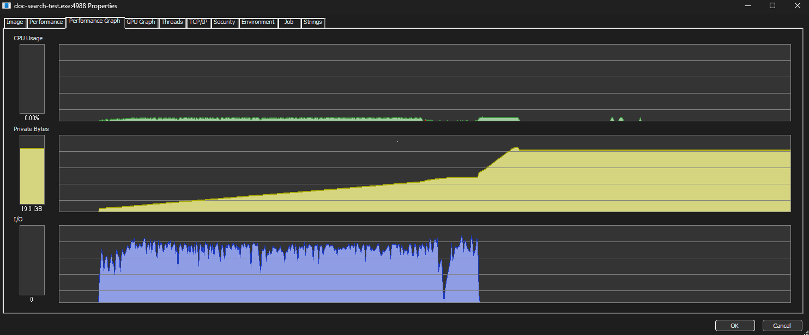

`vectorizer.search()` メソッドで論理式 + cos類似度を使用した検索テストです  
queryでは`&` `|` `!` `[]` が使えるようにしてます。

## index構築
sudachi termizerを用い、C modeでtokenizeしたのち それらの語彙をさらにA modeでtokenizeしています。


```
 .\target\release\doc-search-test.exe index --docs .\wikipedia_all_articles_fast\wikipedia_all_articles_fast\
\ [01:04:59] ####...##### 2340391/2340391 (100%) idx 600/s ETA 00:00:00 done 
⠁ saving corpus...
Indexing completed: 2339298 docs in 4182.40 sec (559.32 docs/sec)
```

環境:
- CPU: 11900K
- RAM: DDR4 dual-ch 2800 48GB
- allocator: mimalloc on windows

本実装ではIndex生成はマルチスレッド、評価はシングルスレッドでの動作となります。

## Test
以下にあそびでなげまくったqueryの検索結果(top 30) です

以下はProcess Explorerでのメモリ使用量のスクリーンショットですー

20GBくらいメモリ使ってますね。 まぁこれくらいは仕方ないかなーと思います。



```

 .\target\release\doc-search-test.exe shell --top 30
  loading corpus... ###...### 637.51 MiB/637.51 MiB (100%) ETA 00:00:00
  loading vector... ###...### 9.10 GiB/9.10 GiB (100%) ETA 00:00:00
Extending vectorizer...
2339298 documents loaded. Vocab size: 23826929. Token sample dim size: 23826929. Max rev idx len: 2261750. Done 295081 ms
Shell mode. Type a query and press Enter.
Type 'exit' or 'quit' to stop.

> tf & idf
Found 16 results in 0 ms.
results:
score: 0.046332 doc_len: 15579  key: "1041885_Tf-idf.json"
score: 0.015490 doc_len: 1131   key: "230485_ベクトル空間モデル.json"
score: 0.011118 doc_len: 4815   key: "3854581_Okapi BM25.json"
score: 0.005203 doc_len: 1700   key: "2057060_概念検索.json"
score: 0.004974 doc_len: 47     key: "3192028_TFIDF.json"
score: 0.001983 doc_len: 1059   key: "1227639_文書分類.json"
score: 0.001823 doc_len: 1901   key: "3611868_Statistically Improbable Phrases.json"
score: 0.001556 doc_len: 967    key: "1808002_Trustedsource.json"
score: 0.001124 doc_len: 32585  key: "1162486_森本稀哲.json"
score: 0.000903 doc_len: 10622  key: "6889_全文検索.json"
score: 0.000676 doc_len: 9822   key: "1488043_潜在意味解析.json"
score: 0.000646 doc_len: 5394   key: "3420738_Deeplearning4j.json"
score: 0.000556 doc_len: 29609  key: "3396446_りんな (人工知能).json"
score: 0.000437 doc_len: 2485   key: "4523636_Gensim.json"
score: 0.000299 doc_len: 10323  key: "1631292_クロアチア語版ウィキペディア.json"
score: 0.000291 doc_len: 12784  key: "1240103_タグクラウド.json"

> 文書検索
Found 23 results in 0 ms.
results:
score: 0.428511 doc_len: 1712   key: "1479780_文書検索.json"
score: 0.058824 doc_len: 47     key: "1479781_テキスト検索.json"
score: 0.058824 doc_len: 49     key: "3580393_類似文書検索.json"
score: 0.053096 doc_len: 1700   key: "2057060_概念検索.json"
score: 0.034258 doc_len: 5568   key: "2512_検索.json"
score: 0.030327 doc_len: 3349   key: "45114_天城トンネル.json"
score: 0.023773 doc_len: 1324   key: "4331155_検索エンジンインデックス.json"
score: 0.023757 doc_len: 1213   key: "4451160_Neuron ES.json"
score: 0.022734 doc_len: 8324   key: "133121_情報検索.json"
score: 0.020235 doc_len: 1059   key: "1227639_文書分類.json"
score: 0.015907 doc_len: 2560   key: "990140_TREC.json"
score: 0.013025 doc_len: 652    key: "500336_EsTerra.json"
score: 0.007715 doc_len: 3645   key: "2235259_ジョアンナブリッグス研究所.json"
score: 0.006895 doc_len: 9822   key: "1488043_潜在意味解析.json"
score: 0.006800 doc_len: 19186  key: "1687598_インターネット百科事典.json"
score: 0.004786 doc_len: 7667   key: "1657296_三高ビル (久喜市).json"
score: 0.004545 doc_len: 7168   key: "4374317_ジブカイン.json"
score: 0.004509 doc_len: 78380  key: "70_人工知能.json"
score: 0.003900 doc_len: 27025  key: "4751273_プロンプトエンジニアリング.json"
score: 0.003606 doc_len: 13446  key: "3027541_高野明彦.json"

> 文書検索 | tf | idf
Found 1296 results in 9 ms.
results: 
score: 0.426469 doc_len: 1712   key: "1479780_文書検索.json"
score: 0.058543 doc_len: 47     key: "1479781_テキスト検索.json"
score: 0.058543 doc_len: 49     key: "3580393_類似文書検索.json"
score: 0.053350 doc_len: 1700   key: "2057060_概念検索.json"
score: 0.034095 doc_len: 5568   key: "2512_検索.json"
score: 0.030182 doc_len: 3349   key: "45114_天城トンネル.json"
score: 0.023660 doc_len: 1324   key: "4331155_検索エンジンインデックス.json"
score: 0.023644 doc_len: 1213   key: "4451160_Neuron ES.json"
score: 0.022626 doc_len: 8324   key: "133121_情報検索.json"
score: 0.020331 doc_len: 1059   key: "1227639_文書分類.json"
score: 0.015831 doc_len: 2560   key: "990140_TREC.json"
score: 0.012963 doc_len: 652    key: "500336_EsTerra.json"
score: 0.007678 doc_len: 3645   key: "2235259_ジョアンナブリッグス研究所.json"
score: 0.006928 doc_len: 9822   key: "1488043_潜在意味解析.json"
score: 0.006768 doc_len: 19186  key: "1687598_インターネット百科事典.json"
score: 0.004763 doc_len: 7667   key: "1657296_三高ビル (久喜市).json"
score: 0.004523 doc_len: 7168   key: "4374317_ジブカイン.json"
score: 0.004518 doc_len: 15579  key: "1041885_Tf-idf.json"
score: 0.004487 doc_len: 78380  key: "70_人工知能.json"
score: 0.003881 doc_len: 27025  key: "4751273_プロンプトエンジニアリング.json"

> 文書検索 & tf & idf
Found 3 results in 0 ms.
results:
score: 0.053350 doc_len: 1700   key: "2057060_概念検索.json"
score: 0.020331 doc_len: 1059   key: "1227639_文書分類.json"
score: 0.006928 doc_len: 9822   key: "1488043_潜在意味解析.json"

> tf & idf & !文書検索
Found 13 results in 9 ms.
results: 
score: 0.004518 doc_len: 15579  key: "1041885_Tf-idf.json"
score: 0.001511 doc_len: 1131   key: "230485_ベクトル空間モデル.json"
score: 0.001084 doc_len: 4815   key: "3854581_Okapi BM25.json"
score: 0.000485 doc_len: 47     key: "3192028_TFIDF.json"
score: 0.000178 doc_len: 1901   key: "3611868_Statistically Improbable Phrases.json"
score: 0.000152 doc_len: 967    key: "1808002_Trustedsource.json"
score: 0.000110 doc_len: 32585  key: "1162486_森本稀哲.json"
score: 0.000088 doc_len: 10622  key: "6889_全文検索.json"
score: 0.000063 doc_len: 5394   key: "3420738_Deeplearning4j.json"
score: 0.000054 doc_len: 29609  key: "3396446_りんな (人工知能).json"
score: 0.000043 doc_len: 2485   key: "4523636_Gensim.json"
score: 0.000029 doc_len: 10323  key: "1631292_クロアチア語版ウィキペディア.json"
score: 0.000028 doc_len: 12784  key: "1240103_タグクラウド.json"

> tf & idf | !文書検索
Found 2339278 results in 4004 ms.
results: 
score: 0.053350 doc_len: 1700   key: "2057060_概念検索.json"
score: 0.020331 doc_len: 1059   key: "1227639_文書分類.json"
score: 0.006928 doc_len: 9822   key: "1488043_潜在意味解析.json"
score: 0.004518 doc_len: 15579  key: "1041885_Tf-idf.json"
score: 0.001511 doc_len: 1131   key: "230485_ベクトル空間モデル.json"
score: 0.001441 doc_len: 1266   key: "1265098_世界糖尿病デー.json"
score: 0.001084 doc_len: 4815   key: "3854581_Okapi BM25.json"
score: 0.000605 doc_len: 40616  key: "3571668_細川成也.json"
score: 0.000582 doc_len: 12955  key: "911152_星孝典.json"
score: 0.000565 doc_len: 8748   key: "4893054_ヤハロム (イスラエル国防軍).json"
score: 0.000529 doc_len: 13821  key: "324963_米野智人.json"
score: 0.000529 doc_len: 1476   key: "1411811_インテル・デベロッパー・フォーラム.json"
score: 0.000522 doc_len: 7086   key: "3325616_網谷圭将.json"
score: 0.000494 doc_len: 88150  key: "4984870_レバノン侵攻 (2024年).json"
score: 0.000487 doc_len: 14789  key: "164400_鈴木健 (内野手).json"
score: 0.000485 doc_len: 47     key: "3192028_TFIDF.json"
score: 0.000446 doc_len: 76287  key: "4274791_イスラエル国防軍軍律.json"
score: 0.000442 doc_len: 24835  key: "2713806_田村龍弘.json"
score: 0.000427 doc_len: 22387  key: "3750723_清水達也 (投手).json"
score: 0.000423 doc_len: 5213   key: "3213593_2015年アジアラグビーチャンピオンシップ.json"

> ![ tf & idf ] & 文書検索
Found 20 results in 9 ms.
results:
score: 0.426469 doc_len: 1712   key: "1479780_文書検索.json"
score: 0.058543 doc_len: 47     key: "1479781_テキスト検索.json"
score: 0.058543 doc_len: 49     key: "3580393_類似文書検索.json"
score: 0.034095 doc_len: 5568   key: "2512_検索.json"
score: 0.030182 doc_len: 3349   key: "45114_天城トンネル.json"
score: 0.023660 doc_len: 1324   key: "4331155_検索エンジンインデックス.json"
score: 0.023644 doc_len: 1213   key: "4451160_Neuron ES.json"
score: 0.022626 doc_len: 8324   key: "133121_情報検索.json"
score: 0.015831 doc_len: 2560   key: "990140_TREC.json"
score: 0.012963 doc_len: 652    key: "500336_EsTerra.json"
score: 0.007678 doc_len: 3645   key: "2235259_ジョアンナブリッグス研究所.json"
score: 0.006768 doc_len: 19186  key: "1687598_インターネット百科事典.json"
score: 0.004763 doc_len: 7667   key: "1657296_三高ビル (久喜市).json"
score: 0.004523 doc_len: 7168   key: "4374317_ジブカイン.json"
score: 0.004487 doc_len: 78380  key: "70_人工知能.json"
score: 0.003881 doc_len: 27025  key: "4751273_プロンプトエンジニアリング.json"
score: 0.003589 doc_len: 13446  key: "3027541_高野明彦.json"
score: 0.003335 doc_len: 31662  key: "4508087_学術データベースと検索エンジンの一覧.json"
score: 0.002371 doc_len: 58766  key: "4769449_大規模言語モデル.json"
score: 0.001922 doc_len: 25272  key: "4281411_ヴァイルブルク.json"

> [ tf & idf ] & !文書検索               
Found 13 results in 7 ms.
results:
score: 0.004518 doc_len: 15579  key: "1041885_Tf-idf.json"
score: 0.001511 doc_len: 1131   key: "230485_ベクトル空間モデル.json"
score: 0.001084 doc_len: 4815   key: "3854581_Okapi BM25.json"
score: 0.000485 doc_len: 47     key: "3192028_TFIDF.json"
score: 0.000178 doc_len: 1901   key: "3611868_Statistically Improbable Phrases.json"
score: 0.000152 doc_len: 967    key: "1808002_Trustedsource.json"
score: 0.000110 doc_len: 32585  key: "1162486_森本稀哲.json"
score: 0.000088 doc_len: 10622  key: "6889_全文検索.json"
score: 0.000063 doc_len: 5394   key: "3420738_Deeplearning4j.json"
score: 0.000054 doc_len: 29609  key: "3396446_りんな (人工知能).json"
score: 0.000043 doc_len: 2485   key: "4523636_Gensim.json"
score: 0.000029 doc_len: 10323  key: "1631292_クロアチア語版ウィキペディア.json"
score: 0.000028 doc_len: 12784  key: "1240103_タグクラウド.json"

> 日本語
Found 133840 results in 524 ms.
results: 
score: 0.002842 doc_len: 555    key: "224_日本の漫画作品一覧.json"
score: 0.001957 doc_len: 102    key: "2625_かな漢字変換.json"
score: 0.000893 doc_len: 11968  key: "173719_外国語の日本語表記.json"
score: 0.000699 doc_len: 7472   key: "1872293_日本語教師.json"
score: 0.000634 doc_len: 23786  key: "4698443_アリー my Loveの登場人物.json"
score: 0.000622 doc_len: 416    key: "6613_洋書.json"
score: 0.000584 doc_len: 2738   key: "1875282_日本語教室.json"
score: 0.000508 doc_len: 1927   key: "18362_セキュリティ.json"
score: 0.000440 doc_len: 350    key: "7237_JPN.json"
score: 0.000430 doc_len: 2148   key: "201149_にほんごでくらそう.json"
score: 0.000421 doc_len: 5500   key: "2552221_日本文学科.json"
score: 0.000417 doc_len: 4099   key: "1701742_村上吉文.json"
score: 0.000402 doc_len: 22696  key: "378548_日本語の表記体系.json"
score: 0.000388 doc_len: 10192  key: "238553_日本語教育.json"
score: 0.000374 doc_len: 478    key: "16447_中つ国.json"
score: 0.000352 doc_len: 443    key: "5987_雅子.json"
score: 0.000348 doc_len: 7017   key: "4373538_日本語教育の推進に関する法律.json"
score: 0.000342 doc_len: 1625   key: "553420_日本語訳.json"
score: 0.000332 doc_len: 4872   key: "116100_別科.json"
score: 0.000315 doc_len: 1605   key: "2226625_森田良行.json"

> !日本語
Found 2205458 results in 2734 ms.
results: 
score: 0.000000 doc_len: 43     key: "1000001_キイウ.json"
score: 0.000000 doc_len: 51     key: "1000052_Pヴァイン・レコード.json"
score: 0.000000 doc_len: 46     key: "1000004_専ブラ.json"
score: 0.000000 doc_len: 64     key: "1000022_大分県立大分女子高等学校.json"
score: 0.000000 doc_len: 58     key: "1000055_世界複合遺産.json"
score: 0.000000 doc_len: 65     key: "1000026_大分県立別府緑丘高等学校.json"
score: 0.000000 doc_len: 75     key: "1000023_大分県立芸術文化短期大学附属緑丘高等学校.json"
score: 0.000000 doc_len: 64     key: "1000020_大分県立水産高等学校.json"
score: 0.000000 doc_len: 51     key: "1000019_ほんわかテレビ.json"
score: 0.000000 doc_len: 69     key: "1000039_国立特殊教育総合研究所.json"
score: 0.000000 doc_len: 47     key: "1000061_Pヴァインレコード.json"
score: 0.000000 doc_len: 62     key: "1000067_岐阜県道50号.json"
score: 0.000000 doc_len: 61     key: "1000069_大垣環状線.json"
score: 0.000000 doc_len: 50     key: "1000063_コパヒー.json"
score: 0.000000 doc_len: 67     key: "100001_東京都道427号.json"
score: 0.000000 doc_len: 68     key: "100002_東京都道405号.json"
score: 0.000000 doc_len: 50     key: "1000075_オクスフォード英語辞典.json"
score: 0.000000 doc_len: 53     key: "1000081_ステファン・フメレツキイ.json"
score: 0.000000 doc_len: 71     key: "1000025_大分県立芸術短期大学付属緑丘高等学校.json"
score: 0.000000 doc_len: 53     key: "1000083_準起訴手続.json"

> りんご
Found 3891 results in 28 ms.
results:
score: 0.024984 doc_len: 9495   key: "4782394_青森りんご勲章.json"
score: 0.010253 doc_len: 9322   key: "3079005_日本最古のりんごの木.json"
score: 0.006563 doc_len: 12829  key: "3113064_国光 (リンゴ).json"
score: 0.006253 doc_len: 9065   key: "4527858_つがる (リンゴ).json"
score: 0.005108 doc_len: 4943   key: "2290110_極楽りんご.json"
score: 0.005080 doc_len: 8556   key: "3105222_ケントの花.json"
score: 0.004523 doc_len: 17417  key: "1756387_ふじ (リンゴ).json"
score: 0.004259 doc_len: 43     key: "25652_りんご.json"
score: 0.003975 doc_len: 61989  key: "441142_りんご娘.json"
score: 0.003970 doc_len: 2002   key: "1242749_おまもりんごさん.json"
score: 0.003595 doc_len: 3059   key: "783826_ママ・トラブル.json"
score: 0.003325 doc_len: 11190  key: "94620_Princess Holiday 〜転がるりんご亭千夜一夜〜.json"
score: 0.003184 doc_len: 5848   key: "4533981_弘果弘前中央青果.json"
score: 0.003154 doc_len: 7934   key: "2675366_産地直送 日本最高!!.json"
score: 0.003055 doc_len: 3606   key: "1098897_デリシャス!.json"
score: 0.002872 doc_len: 1028   key: "4240439_りんごの木の下で.json"
score: 0.002825 doc_len: 874    key: "496267_リンゴ (曖昧さ回避).json"
score: 0.002743 doc_len: 36301  key: "1720252_リルぷりっ.json"
score: 0.002524 doc_len: 47     key: "102641_りんごあめ.json"
score: 0.002389 doc_len: 7379   key: "1374978_平成 新・鬼ヶ島.json"

> アップル
Found 13412 results in 89 ms.
results: 
score: 0.070354 doc_len: 45     key: "2175_アップルコンピューター.json"
score: 0.013839 doc_len: 43     key: "2289_Apple Computer.json"
score: 0.007914 doc_len: 8715   key: "4943252_IPadOS 18.json"
score: 0.007046 doc_len: 660    key: "2063_山本優子.json"
score: 0.006822 doc_len: 4709   key: "614373_ジャック・ローズ.json"
score: 0.006614 doc_len: 927    key: "518844_ビッグ・アップル.json"
score: 0.006021 doc_len: 2315   key: "1147804_Appleキー.json"
score: 0.005819 doc_len: 13310  key: "4941587_IOS 18.json"
score: 0.005728 doc_len: 21519  key: "682437_Apple TV.json"
score: 0.005601 doc_len: 9935   key: "4941659_MacOS Sequoia.json"
score: 0.005372 doc_len: 102934 key: "14706_Apple.json"
score: 0.005162 doc_len: 1603   key: "2170_アップル.json"
score: 0.005161 doc_len: 8342   key: "2138644_アップル対アップル訴訟.json"
score: 0.004670 doc_len: 2578   key: "1686413_ムーンライト・クーラー.json"
score: 0.004412 doc_len: 14180  key: "660318_Worldwide Developers Conference.json"
score: 0.004380 doc_len: 1937   key: "1230856_ビッグ・アップル (カクテル).json"
score: 0.004351 doc_len: 2656   key: "4928630_Apple M4.json"
score: 0.004187 doc_len: 36604  key: "1545_MacOS.json"
score: 0.004035 doc_len: 2765   key: "4226435_Apple One.json"
score: 0.003974 doc_len: 3865   key: "4990906_IPad mini (A17 Pro).json"

> Apple
Found 5929 results in 37 ms.
results:
score: 0.053045 doc_len: 45     key: "2175_アップルコンピューター.json"
score: 0.031303 doc_len: 43     key: "2289_Apple Computer.json"
score: 0.013679 doc_len: 8715   key: "4943252_IPadOS 18.json"
score: 0.012888 doc_len: 2315   key: "1147804_Appleキー.json"
score: 0.010203 doc_len: 13310  key: "4941587_IOS 18.json"
score: 0.009341 doc_len: 9935   key: "4941659_MacOS Sequoia.json"
score: 0.007345 doc_len: 2765   key: "4226435_Apple One.json"
score: 0.007175 doc_len: 2656   key: "4928630_Apple M4.json"
score: 0.007130 doc_len: 3865   key: "4990906_IPad mini (A17 Pro).json"
score: 0.006274 doc_len: 102934 key: "14706_Apple.json"
score: 0.005856 doc_len: 21519  key: "682437_Apple TV.json"
score: 0.005134 doc_len: 14180  key: "660318_Worldwide Developers Conference.json"
score: 0.005058 doc_len: 36604  key: "1545_MacOS.json"
score: 0.005050 doc_len: 1552   key: "3279543_Apple A9X.json"
score: 0.004915 doc_len: 55254  key: "1542_Mac (コンピュータ).json"
score: 0.004756 doc_len: 2609   key: "3493560_Apple A10.json"
score: 0.004702 doc_len: 8882   key: "4941597_Apple Intelligence.json"
score: 0.004691 doc_len: 2087   key: "4995983_Apple M4 Pro.json"
score: 0.004582 doc_len: 2615   key: "4787151_Apple M2 Ultra.json"
score: 0.004504 doc_len: 4278   key: "4453202_IPad mini (第6世代).json"

> 数学 & NP
Found 264 results in 2 ms.
results:
score: 0.013619 doc_len: 740    key: "718999_Co-NP.json"
score: 0.013419 doc_len: 3072   key: "10021_NP困難.json"
score: 0.009596 doc_len: 2836   key: "405452_ネイマン・ピアソンの補題.json"
score: 0.009416 doc_len: 10428  key: "9966_P≠NP予想.json"
score: 0.008405 doc_len: 3172   key: "1039863_神託機械.json"
score: 0.006486 doc_len: 2281   key: "549858_計算機科学の未解決問題.json"
score: 0.005951 doc_len: 2924   key: "1090250_RP (計算複雑性理論).json"
score: 0.004407 doc_len: 836    key: "1112768_UP (計算複雑性理論).json"
score: 0.004021 doc_len: 18478  key: "1105_生成文法.json"
score: 0.003968 doc_len: 12221  key: "2537_計算複雑性理論.json"
score: 0.003811 doc_len: 7591   key: "1124390_多項式階層.json"
score: 0.003379 doc_len: 745    key: "10047_ハミルトン閉路問題.json"
score: 0.003332 doc_len: 15330  key: "1638518_ジェームズ・ジェローム・ヒル.json"
score: 0.003131 doc_len: 2548   key: "1354662_PCP (計算複雑性理論).json"
score: 0.003093 doc_len: 4596   key: "2722690_範疇文法.json"
score: 0.002916 doc_len: 1095   key: "1113368_PH (計算複雑性理論).json"
score: 0.002904 doc_len: 4576   key: "9911_NP.json"
score: 0.002787 doc_len: 2619   key: "713055_多項式時間変換.json"
score: 0.002733 doc_len: 1550   key: "742347_BPP (計算複雑性理論).json"
score: 0.002692 doc_len: 1756   key: "1115981_＃P.json"

> 数学 & NP & グラフ
Found 81 results in 0 ms.
results:
score: 0.009288 doc_len: 10428  key: "9966_P≠NP予想.json"
score: 0.003923 doc_len: 12221  key: "2537_計算複雑性理論.json"
score: 0.003685 doc_len: 745    key: "10047_ハミルトン閉路問題.json"
score: 0.002871 doc_len: 4576   key: "9911_NP.json"
score: 0.002733 doc_len: 1756   key: "1115981_＃P.json"
score: 0.002264 doc_len: 4226   key: "10595_NP完全問題.json"
score: 0.002194 doc_len: 711    key: "700392_頂点被覆問題.json"
score: 0.002177 doc_len: 2271   key: "2672964_K-辺連結グラフ.json"
score: 0.001828 doc_len: 24981  key: "1358867_グラフ彩色.json"
score: 0.001763 doc_len: 11135  key: "3706221_Arthur–Merlinプロトコル.json"
score: 0.001628 doc_len: 2722   key: "1819406_完全2部グラフ.json"
score: 0.001326 doc_len: 784    key: "324077_最小頂点被覆問題.json"
score: 0.001175 doc_len: 2324   key: "1850048_独立集合.json"
score: 0.001094 doc_len: 815    key: "2317945_シュタイナー木.json"
score: 0.001064 doc_len: 7933   key: "4044913_インスタント・インサニティ.json"
score: 0.001028 doc_len: 823    key: "1819455_補グラフ.json"
score: 0.000950 doc_len: 535    key: "328875_最小極大マッチング問題.json"
score: 0.000940 doc_len: 7517   key: "1870577_頂点被覆.json"
score: 0.000934 doc_len: 1891   key: "13127_グラフ同型.json"
score: 0.000913 doc_len: 2677   key: "1820380_種数.json"

> LLVM
Found 87 results in 0 ms.
results:
score: 0.076164 doc_len: 13540  key: "1827400_Clang.json"
score: 0.061825 doc_len: 6346   key: "1130793_LLVM.json"
score: 0.040009 doc_len: 1699   key: "3715653_LLDB.json"
score: 0.033454 doc_len: 6117   key: "1112500_中間表現.json"
score: 0.026353 doc_len: 2546   key: "72735_リンケージエディタ.json"
score: 0.022066 doc_len: 11452  key: "3247865_ヘテロジニアス・コンピューティング.json"
score: 0.020918 doc_len: 5490   key: "4986062_LEB128.json"
score: 0.019756 doc_len: 1850   key: "3972591_Ninja (ソフトウェア).json"
score: 0.018416 doc_len: 27337  key: "1469124_OpenCL.json"
score: 0.017651 doc_len: 4787   key: "3780536_C--.json"
score: 0.017088 doc_len: 3027   key: "3822400_イリノイ大学_NCSAオープンソースライセンス.json"
score: 0.016067 doc_len: 49     key: "2901353_Low Level Virtual Machine.json"
score: 0.014274 doc_len: 719    key: "1210380_ツールチェーン.json"
score: 0.012030 doc_len: 7709   key: "227432_SIMD.json"
score: 0.008399 doc_len: 58608  key: "1091_FreeBSD.json"
score: 0.007874 doc_len: 7546   key: "1288767_Mac OS X v10.5.json"
score: 0.007327 doc_len: 11558  key: "189629_プログラミング言語年表.json"
score: 0.006956 doc_len: 25711  key: "2679494_Unity (ゲームエンジン).json"
score: 0.006775 doc_len: 6876   key: "1058943_Mono (ソフトウェア).json"
score: 0.006169 doc_len: 3684   key: "4770392_Qt Creator.json"

> コンパイラ & バックエンド
Found 73 results in 0 ms.
results:
score: 0.077359 doc_len: 3870   key: "51786_フロントエンド.json"
score: 0.010089 doc_len: 22367  key: "1394_コンパイラ.json"
score: 0.007454 doc_len: 29010  key: "1022_C言語.json"
score: 0.006259 doc_len: 4304   key: "1343352_クロスコンパイラ.json"
score: 0.005572 doc_len: 2792   key: "1117526_定数畳み込み.json"
score: 0.003636 doc_len: 3369   key: "1007366_OpenAL.json"
score: 0.003391 doc_len: 6117   key: "1112500_中間表現.json"
score: 0.003266 doc_len: 2136   key: "878808_Javaコンパイラ.json"
score: 0.003176 doc_len: 11452  key: "3247865_ヘテロジニアス・コンピューティング.json"
score: 0.003020 doc_len: 1800   key: "866345_抽象構文木.json"
score: 0.003006 doc_len: 19049  key: "884430_JavaとC++の比較.json"
score: 0.002795 doc_len: 9266   key: "1453681_静的単一代入.json"
score: 0.002439 doc_len: 2715   key: "1864948_CMU Common Lisp.json"
score: 0.002365 doc_len: 11558  key: "189629_プログラミング言語年表.json"
score: 0.002166 doc_len: 27337  key: "1469124_OpenCL.json"
score: 0.002113 doc_len: 8096   key: "3630489_ANSI C.json"
score: 0.001973 doc_len: 12634  key: "2772_Pascal.json"
score: 0.001739 doc_len: 3451   key: "3864747_サイモン・ペイトン・ジョーンズ.json"
score: 0.001707 doc_len: 2031   key: "661623_GNU Pascal.json"
score: 0.001665 doc_len: 8490   key: "3864517_Glasgow Haskell Compiler.json"

> 最適化
Found 4106 results in 32 ms.
results:
score: 0.011124 doc_len: 12799  key: "995859_最適化 (情報工学).json"
score: 0.010058 doc_len: 15065  key: "399219_コンパイラ最適化.json"
score: 0.002719 doc_len: 3354   key: "140774_動的型付け.json"
score: 0.002353 doc_len: 1027   key: "983827_最適化.json"
score: 0.002352 doc_len: 2294   key: "344627_メカチューン.json"
score: 0.002149 doc_len: 2960   key: "1115136_デッドコード削除.json"
score: 0.001964 doc_len: 2705   key: "176533_リアルビジネスサイクル理論.json"
score: 0.001931 doc_len: 4005   key: "652850_参照の局所性.json"
score: 0.001621 doc_len: 11320  key: "52410_マクロ経済学.json"
score: 0.001418 doc_len: 5753   key: "27676_変分モンテカルロ法.json"
score: 0.001363 doc_len: 2371   key: "568939_進化的アルゴリズム.json"
score: 0.001356 doc_len: 1068   key: "1513660_X-tune.json"
score: 0.001349 doc_len: 5307   key: "512983_最適化モデル.json"
score: 0.001344 doc_len: 1643   key: "4288693_サービス管理.json"
score: 0.001217 doc_len: 559    key: "2061609_入力フォーム最適化.json"
score: 0.001213 doc_len: 380    key: "124812_ロジスティクス工学.json"
score: 0.001179 doc_len: 5161   key: "54185_JR貨物EF500形電気機関車.json"
score: 0.001151 doc_len: 3314   key: "3328045_AIO.json"
score: 0.001127 doc_len: 2661   key: "3079559_逐次最小問題最適化法.json"
score: 0.001102 doc_len: 3230   key: "1563300_分枝限定法.json"

> プログラム & 最適化
Found 1349 results in 11 ms.
results:
score: 0.011118 doc_len: 12799  key: "995859_最適化 (情報工学).json"
score: 0.010052 doc_len: 15065  key: "399219_コンパイラ最適化.json"
score: 0.002731 doc_len: 3354   key: "140774_動的型付け.json"
score: 0.002348 doc_len: 1027   key: "983827_最適化.json"
score: 0.002154 doc_len: 2960   key: "1115136_デッドコード削除.json"
score: 0.001953 doc_len: 4005   key: "652850_参照の局所性.json"
score: 0.001371 doc_len: 2371   key: "568939_進化的アルゴリズム.json"
score: 0.001021 doc_len: 1515   key: "1749940_エスケープ解析.json"
score: 0.001013 doc_len: 4141   key: "790343_インライン展開.json"
score: 0.000989 doc_len: 2792   key: "1117526_定数畳み込み.json"
score: 0.000939 doc_len: 3870   key: "51786_フロントエンド.json"
score: 0.000929 doc_len: 4805   key: "1779046_命令セットシミュレータ.json"
score: 0.000929 doc_len: 3354   key: "1987_並列化.json"
score: 0.000862 doc_len: 3426   key: "3821319_メモリモデル (プログラミング).json"
score: 0.000847 doc_len: 2568   key: "3027737_コピーの省略.json"
score: 0.000846 doc_len: 41278  key: "534184_スーパーコンピュータ技術史.json"
score: 0.000839 doc_len: 22367  key: "1394_コンパイラ.json"
score: 0.000817 doc_len: 19049  key: "884430_JavaとC++の比較.json"
score: 0.000793 doc_len: 1623   key: "4532747_原嶋勝美.json"
score: 0.000789 doc_len: 3763   key: "1752908_エイリアス解析.json"

> !
Found 2339298 results in 2938 ms.
results: 
score: 0.000000 doc_len: 43     key: "1000001_キイウ.json"
score: 0.000000 doc_len: 51     key: "1000052_Pヴァイン・レコード.json"
score: 0.000000 doc_len: 46     key: "1000004_専ブラ.json"
score: 0.000000 doc_len: 64     key: "1000022_大分県立大分女子高等学校.json"
score: 0.000000 doc_len: 58     key: "1000055_世界複合遺産.json"
score: 0.000000 doc_len: 65     key: "1000026_大分県立別府緑丘高等学校.json"
score: 0.000000 doc_len: 75     key: "1000023_大分県立芸術文化短期大学附属緑丘高等学校.json"
score: 0.000000 doc_len: 64     key: "1000020_大分県立水産高等学校.json"
score: 0.000000 doc_len: 51     key: "1000019_ほんわかテレビ.json"
score: 0.000000 doc_len: 69     key: "1000039_国立特殊教育総合研究所.json"
score: 0.000000 doc_len: 47     key: "1000061_Pヴァインレコード.json"
score: 0.000000 doc_len: 62     key: "1000067_岐阜県道50号.json"
score: 0.000000 doc_len: 61     key: "1000069_大垣環状線.json"
score: 0.000000 doc_len: 50     key: "1000063_コパヒー.json"
score: 0.000000 doc_len: 67     key: "100001_東京都道427号.json"
score: 0.000000 doc_len: 68     key: "100002_東京都道405号.json"
score: 0.000000 doc_len: 50     key: "1000075_オクスフォード英語辞典.json"
score: 0.000000 doc_len: 53     key: "1000081_ステファン・フメレツキイ.json"
score: 0.000000 doc_len: 71     key: "1000025_大分県立芸術短期大学付属緑丘高等学校.json"
score: 0.000000 doc_len: 53     key: "1000083_準起訴手続.json"

> が | の | と | に | !
Found 2339298 results in 3150 ms.
results: 
score: 0.003791 doc_len: 56     key: "143_ミュージシャン一覧 (個人).json"
score: 0.003339 doc_len: 555    key: "224_日本の漫画作品一覧.json"
score: 0.002773 doc_len: 78     key: "465_東京を舞台にした漫画作品.json"
score: 0.002469 doc_len: 2853   key: "9207_ご当地映画.json"
score: 0.001481 doc_len: 60     key: "456_必要とされている記事.json"
score: 0.001441 doc_len: 18944  key: "42832_プレーオフ制度 (日本プロ野球).json"
score: 0.001423 doc_len: 2570   key: "4019_日本の鉄道駅一覧.json"
score: 0.001421 doc_len: 62     key: "467_必要とされている画像.json"
score: 0.001402 doc_len: 3146   key: "8442_物体.json"
score: 0.001306 doc_len: 54     key: "356_現在のイベント.json"
score: 0.001291 doc_len: 5467   key: "38000_世界各国関係記事の一覧.json"
score: 0.001273 doc_len: 817    key: "6606_新刊.json"
score: 0.001141 doc_len: 62     key: "2784835_海 (姓).json"
score: 0.001103 doc_len: 113    key: "2787396_銭 (姓).json"
score: 0.001061 doc_len: 988    key: "4091_日本の鉄道路線一覧.json"
score: 0.001016 doc_len: 191    key: "2795223_西村学.json"
score: 0.000997 doc_len: 3103   key: "12498_どきどき姉弟ライフ.json"
score: 0.000986 doc_len: 190    key: "2788149_樹下太郎.json"
score: 0.000961 doc_len: 307    key: "2788650_駒橋恵子.json"
score: 0.000946 doc_len: 11832  key: "97650_新性能電車.json"
```

### その他のアルゴリズム

cos類似度 bm25 dotの順
```
> LLM
Found 119 results in 1 ms.
results:
score: 0.077858 doc_len: 2448   key: "2640471_LLM01レーザー光モジュール.json"
score: 0.038581 doc_len: 44447  key: "44366_日本の法学者一覧.json"
score: 0.037638 doc_len: 58766  key: "4769449_大規模言語モデル.json"
score: 0.035310 doc_len: 131    key: "4759323_LLM.json"
score: 0.031730 doc_len: 10500  key: "4935110_確率的オウム.json"
score: 0.028239 doc_len: 1126   key: "22377_パーム.json"
score: 0.020278 doc_len: 27025  key: "4751273_プロンプトエンジニアリング.json"
score: 0.019943 doc_len: 5927   key: "4766876_PaLM.json"
score: 0.019240 doc_len: 1686   key: "4964138_LoRA.json"
score: 0.017894 doc_len: 2910   key: "1303451_南メソジスト大学.json"
score: 0.017520 doc_len: 1065   key: "2039425_修士（法学）.json"
score: 0.016403 doc_len: 2175   key: "180384_山田卓生.json"
score: 0.012933 doc_len: 1956   key: "4963868_PLaMo.json"
score: 0.011636 doc_len: 3656   key: "1421905_成瀬正恭.json"
score: 0.011607 doc_len: 9672   key: "791339_バッキンガム大学.json"
score: 0.011277 doc_len: 1245   key: "2379379_水島朋則.json"
score: 0.010774 doc_len: 1572   key: "696181_佐久川政一.json"
score: 0.010692 doc_len: 16294  key: "4758043_Gemini (チャットボット).json"
score: 0.009370 doc_len: 1084   key: "1857855_ダルハウジー・ロースクール.json"
score: 0.008665 doc_len: 1403   key: "4831918_吉田晶子.json"
score: 0.008572 doc_len: 2592   key: "1452212_ジョホール・シンガポール・コーズウェイ.json"
score: 0.008253 doc_len: 2121   key: "4759287_Microsoft 365 Copilot.json"
score: 0.008078 doc_len: 2782   key: "4361780_窪野鎮治.json"
score: 0.008041 doc_len: 1591   key: "4583456_田中崇公.json"
score: 0.007683 doc_len: 6905   key: "1546632_高知県立高知小津高等学校.json"
score: 0.007444 doc_len: 7121   key: "3153565_アルバート・グレイ (第4代グレイ伯爵).json"
score: 0.007435 doc_len: 790    key: "4782503_ノートル・ダム・ロー・スクール.json"
score: 0.007287 doc_len: 5660   key: "4856155_Grok.json"
score: 0.006895 doc_len: 3961   key: "1338773_ハーバード・ロー・スクール.json"
score: 0.006790 doc_len: 2701   key: "2167501_本林徹.json"

> bm25: LLM
Found 119 results in 3 ms.
results:
score: 20.653216        doc_len: 2448   key: "2640471_LLM01レーザー光モジュール.json"
score: 19.520232        doc_len: 131    key: "4759323_LLM.json"
score: 18.867423        doc_len: 10500  key: "4935110_確率的オウム.json"
score: 17.759890        doc_len: 1956   key: "4963868_PLaMo.json"
score: 17.669508        doc_len: 58766  key: "4769449_大規模言語モデル.json"
score: 17.617854        doc_len: 5927   key: "4766876_PaLM.json"
score: 17.100447        doc_len: 1686   key: "4964138_LoRA.json"
score: 16.370827        doc_len: 27025  key: "4751273_プロンプトエンジニアリング.json"
score: 15.670108        doc_len: 2831   key: "4758134_LLaMA.json"
score: 15.580194        doc_len: 2910   key: "1303451_南メソジスト大学.json"
score: 15.228464        doc_len: 3228   key: "4740919_Turing (企業).json"
score: 14.779397        doc_len: 3656   key: "1421905_成瀬正恭.json"
score: 14.438943        doc_len: 5660   key: "4856155_Grok.json"
score: 14.110345        doc_len: 790    key: "4782503_ノートル・ダム・ロー・スクール.json"
score: 13.384018        doc_len: 1065   key: "2039425_修士（法学）.json"
score: 13.336588        doc_len: 1084   key: "1857855_ダルハウジー・ロースクール.json"
score: 13.232924        doc_len: 1126   key: "22377_パーム.json"
score: 12.947774        doc_len: 1245   key: "2379379_水島朋則.json"
score: 12.873180        doc_len: 1277   key: "4983954_マリーナ・デル・ピラール・アビラ・オルメダ.json"
score: 12.587634        doc_len: 1403   key: "4831918_吉田晶子.json"
score: 12.555360        doc_len: 6227   key: "4948987_FCペシュ.json"
score: 12.223956        doc_len: 1572   key: "696181_佐久川政一.json"
score: 12.184378        doc_len: 1591   key: "4583456_田中崇公.json"
score: 12.007034        doc_len: 9672   key: "791339_バッキンガム大学.json"
score: 11.584282        doc_len: 1895   key: "4788081_藤田早苗.json"
score: 11.175111        doc_len: 2121   key: "4759287_Microsoft 365 Copilot.json"
score: 11.081587        doc_len: 2175   key: "180384_山田卓生.json"
score: 11.038817        doc_len: 2200   key: "4887466_髙橋彩 (裁判官).json"
score: 10.711394        doc_len: 2398   key: "3880588_山田淳 (外交官).json"
score: 10.627143        doc_len: 16203  key: "4864105_Gemini (言語モデル).json"

> dot: LLM
Found 119 results in 0 ms.
results:
score: 30021730056.732082       doc_len: 58766  key: "4769449_大規模言語モデル.json"
score: 9880569385.759926        doc_len: 27025  key: "4751273_プロンプトエンジニアリング.json"
score: 8740503687.403011        doc_len: 10500  key: "4935110_確率的オウム.json"
score: 7600437989.046097        doc_len: 2448   key: "2640471_LLM01レーザー光モジュール.json"
score: 4560262793.427658        doc_len: 44447  key: "44366_日本の法学者一覧.json"
score: 3420197095.070744        doc_len: 111914 key: "26849_ブロードバンドインターネット接続.json"
score: 3420197095.070744        doc_len: 5927   key: "4766876_PaLM.json"
score: 2660153296.166134        doc_len: 30180  key: "587388_Mathematica.json"
score: 1900109497.261524        doc_len: 29011  key: "3925627_PyTorch.json"
score: 1900109497.261524        doc_len: 16294  key: "4758043_Gemini (チャットボット).json"
score: 1900109497.261524        doc_len: 16203  key: "4864105_Gemini (言語モデル).json"
score: 1520087597.809219        doc_len: 27401  key: "4764901_ハルシネーション (人工知能).json"
score: 1520087597.809219        doc_len: 5660   key: "4856155_Grok.json"
score: 1520087597.809219        doc_len: 1956   key: "4963868_PLaMo.json"
score: 1520087597.809219        doc_len: 9672   key: "791339_バッキンガム大学.json"
score: 1140065698.356915        doc_len: 2910   key: "1303451_南メソジスト大学.json"
score: 1140065698.356915        doc_len: 3656   key: "1421905_成瀬正恭.json"
score: 1140065698.356915        doc_len: 12465  key: "3405194_言語モデル.json"
score: 1140065698.356915        doc_len: 3228   key: "4740919_Turing (企業).json"
score: 1140065698.356915        doc_len: 46389  key: "4754116_生成的人工知能.json"
score: 1140065698.356915        doc_len: 2831   key: "4758134_LLaMA.json"
score: 1140065698.356915        doc_len: 131    key: "4759323_LLM.json"
score: 1140065698.356915        doc_len: 21527  key: "4762474_LaMDA.json"
score: 1140065698.356915        doc_len: 6227   key: "4948987_FCペシュ.json"
score: 1140065698.356915        doc_len: 1686   key: "4964138_LoRA.json"
score: 380021899.452305 doc_len: 28864  key: "11394_チャットボット.json"
score: 380021899.452305 doc_len: 13662  key: "1148606_いぶき (人工衛星).json"
score: 380021899.452305 doc_len: 7697   key: "1275450_HECパリ.json"
score: 380021899.452305 doc_len: 6739   key: "133219_M-15 (航空機).json"
score: 380021899.452305 doc_len: 3961   key: "1338773_ハーバード・ロー・スクール.json"
```

### 複合クエリ
杜撰なテスト

類似文書を探す際はdotが文書超と一致語彙に強く重みをもつため優位気味ですかね
```
> ChatGPT | チャットジーピーティー | は | OpenAI | が | 2022 | 年 | 11 | 月 | に | 公開 | した | GPT | 系列 | の | 大規 | 模言語モデル | を | 用いる | 対話型生成AI | サービス | である | 。 | 愛称 | は | チャッピー
Found 1544415 results in 4047 ms.
results:
score: 0.077986 doc_len: 2681   key: "4661294_藤嶋大規.json"
score: 0.070249 doc_len: 60020  key: "4701415_ChatGPT.json"
score: 0.062759 doc_len: 6585   key: "4662439_松下桃太郎.json"
score: 0.053028 doc_len: 1166   key: "1499007_大規長根.json"
score: 0.047064 doc_len: 27800  key: "3384626_OpenAI.json"
score: 0.042329 doc_len: 10135  key: "4978376_OpenAI o1.json"
score: 0.032087 doc_len: 7473   key: "4940070_GPT-4o.json"
score: 0.024470 doc_len: 6969   key: "4986571_ヘレン・トナー.json"
score: 0.022456 doc_len: 5794   key: "2536851_渡辺善夫.json"
score: 0.022300 doc_len: 22178  key: "4993948_サム・アルトマン解任騒動.json"
score: 0.020871 doc_len: 24951  key: "4737226_GPT-3.json"
score: 0.019985 doc_len: 9935   key: "4941659_MacOS Sequoia.json"
score: 0.019780 doc_len: 6945   key: "554415_暁に斬る!.json"
score: 0.018762 doc_len: 27401  key: "4764901_ハルシネーション (人工知能).json"
score: 0.018703 doc_len: 5312   key: "4196212_3秒聴けば誰でもわかる名曲ベスト100.json"
score: 0.018312 doc_len: 1440   key: "3586107_フリーフレーム工法.json"
score: 0.017520 doc_len: 10554  key: "196817_魔法使いチャッピー.json"
score: 0.016902 doc_len: 16294  key: "4758043_Gemini (チャットボット).json"
score: 0.016678 doc_len: 2698   key: "4998264_エセ子沼.json"
score: 0.016042 doc_len: 7763   key: "4736464_GPT-4.json"
score: 0.015811 doc_len: 1021   key: "4915947_GPTs.json"
score: 0.014726 doc_len: 15329  key: "4589262_タクシー運転手さん一番うまい店に連れてって!.json"
score: 0.014093 doc_len: 15316  key: "4991012_OpenAI Five.json"
score: 0.012636 doc_len: 2577   key: "3571952_西村楠亭.json"
score: 0.012599 doc_len: 5975   key: "4738013_OpenAI Codex.json"
score: 0.012556 doc_len: 7417   key: "4754721_Microsoft Copilot.json"
score: 0.012203 doc_len: 8063   key: "4898333_Sora (人工知能モデル).json"
score: 0.012120 doc_len: 5152   key: "4781835_Anthropic.json"
score: 0.010280 doc_len: 1814   key: "4820893_荒木賢二郎.json"
score: 0.010262 doc_len: 5393   key: "4856348_ミラ・ムラティ.json"

> bm25: ChatGPT | チャットジーピーティー | は | OpenAI | が | 2022 | 年 | 11 | 月 | に | 公開 | した | GPT | 系列 | の | 大規 | 模言語モデル | を | 用いる | 対話型生成AI | サービス | である | 。 | 愛称 | は | チャッピー
Found 1544415 results in 2590 ms.
results:
score: 90.512403        doc_len: 27800  key: "3384626_OpenAI.json"
score: 86.818686        doc_len: 1021   key: "4915947_GPTs.json"
score: 83.335445        doc_len: 60020  key: "4701415_ChatGPT.json"
score: 78.971745        doc_len: 10135  key: "4978376_OpenAI o1.json"
score: 75.515603        doc_len: 7473   key: "4940070_GPT-4o.json"
score: 74.099844        doc_len: 7417   key: "4754721_Microsoft Copilot.json"
score: 71.769902        doc_len: 5595   key: "4751812_GPT (言語モデル).json"
score: 71.213136        doc_len: 24951  key: "4737226_GPT-3.json"
score: 68.567202        doc_len: 16294  key: "4758043_Gemini (チャットボット).json"
score: 67.619108        doc_len: 27401  key: "4764901_ハルシネーション (人工知能).json"
score: 66.613374        doc_len: 5152   key: "4781835_Anthropic.json"
score: 64.483868        doc_len: 267    key: "4755969_Copilot.json"
score: 64.277162        doc_len: 5393   key: "4856348_ミラ・ムラティ.json"
score: 63.569375        doc_len: 11138  key: "4738106_GitHub Copilot.json"
score: 62.553322        doc_len: 16203  key: "4864105_Gemini (言語モデル).json"
score: 62.430503        doc_len: 367    key: "4939861_生成的人工知能の一覧.json"
score: 60.850461        doc_len: 6658   key: "4861702_グレッグ・ブロックマン.json"
score: 58.804740        doc_len: 1792   key: "4984290_SearchGPT.json"
score: 58.603909        doc_len: 4479   key: "4801787_XAI (企業).json"
score: 58.437506        doc_len: 2917   key: "4776314_Search Generative Experience.json"
score: 56.885439        doc_len: 6969   key: "4986571_ヘレン・トナー.json"
score: 56.680406        doc_len: 46389  key: "4754116_生成的人工知能.json"
score: 55.985834        doc_len: 33964  key: "4986569_AIブーム.json"
score: 54.959308        doc_len: 6374   key: "4909236_Claude.json"
score: 54.537023        doc_len: 7763   key: "4736464_GPT-4.json"
score: 53.609942        doc_len: 3753   key: "4905244_Ernie Bot.json"
score: 53.257711        doc_len: 9935   key: "4941659_MacOS Sequoia.json"
score: 52.917758        doc_len: 5830   key: "650068_Microsoft Bing.json"
score: 52.869930        doc_len: 22178  key: "4993948_サム・アルトマン解任騒動.json"
score: 52.840663        doc_len: 5660   key: "4856155_Grok.json"

> dot: ChatGPT | チャットジーピーティー | は | OpenAI | が | 2022 | 年 | 11 | 月 | に | 公開 | した | GPT | 系列 | の | 大規 | 模言語モデル | を | 用いる | 対話型生成AI | サービス | である | 。 | 愛称 | は | チャッピー
Found 1544415 results in 2079 ms.
results:
score: 104772043009.504730      doc_len: 60020  key: "4701415_ChatGPT.json"
score: 42070466897.123093       doc_len: 27800  key: "3384626_OpenAI.json"
score: 21428217858.035591       doc_len: 22178  key: "4993948_サム・アルトマン解任騒動.json"
score: 19139367873.802826       doc_len: 24951  key: "4737226_GPT-3.json"
score: 18214067602.762943       doc_len: 2681   key: "4661294_藤嶋大規.json"
score: 17483905871.410988       doc_len: 27401  key: "4764901_ハルシネーション (人工知能).json"
score: 15419533762.067219       doc_len: 10135  key: "4978376_OpenAI o1.json"
score: 12092424104.976713       doc_len: 43036  key: "4740459_GPT-2.json"
score: 11767926591.252558       doc_len: 15316  key: "4991012_OpenAI Five.json"
score: 10770284247.437614       doc_len: 7473   key: "4940070_GPT-4o.json"
score: 10118927230.444122       doc_len: 6585   key: "4662439_松下桃太郎.json"
score: 10118926069.014826       doc_len: 1166   key: "1499007_大規長根.json"
score: 9167730772.467976        doc_len: 46389  key: "4754116_生成的人工知能.json"
score: 8588665946.179852        doc_len: 14110  key: "4971140_イリヤ・サツケバー.json"
score: 8308888049.620934        doc_len: 5393   key: "4856348_ミラ・ムラティ.json"
score: 8240783884.494093        doc_len: 33964  key: "4986569_AIブーム.json"
score: 8012029299.196327        doc_len: 6969   key: "4986571_ヘレン・トナー.json"
score: 7889079697.781730        doc_len: 16294  key: "4758043_Gemini (チャットボット).json"
score: 7179216143.493526        doc_len: 58766  key: "4769449_大規模言語モデル.json"
score: 6996333045.709897        doc_len: 14330  key: "4753485_DALL-E.json"
score: 6247278851.711879        doc_len: 8063   key: "4898333_Sora (人工知能モデル).json"
score: 6041968766.490527        doc_len: 16203  key: "4864105_Gemini (言語モデル).json"
score: 5861534704.593669        doc_len: 6658   key: "4861702_グレッグ・ブロックマン.json"
score: 5861534579.515177        doc_len: 7763   key: "4736464_GPT-4.json"
score: 5307105327.275814        doc_len: 5975   key: "4738013_OpenAI Codex.json"
score: 5092931824.359727        doc_len: 78380  key: "70_人工知能.json"
score: 5076364102.286947        doc_len: 15688  key: "4737207_サム・アルトマン.json"
score: 4990627810.335804        doc_len: 62793  key: "4798706_AIアライメント.json"
score: 4896372482.943269        doc_len: 117849 key: "1748623_イーロン・マスク.json"
score: 4473184836.688563        doc_len: 11138  key: "4738106_GitHub Copilot.json"
```


